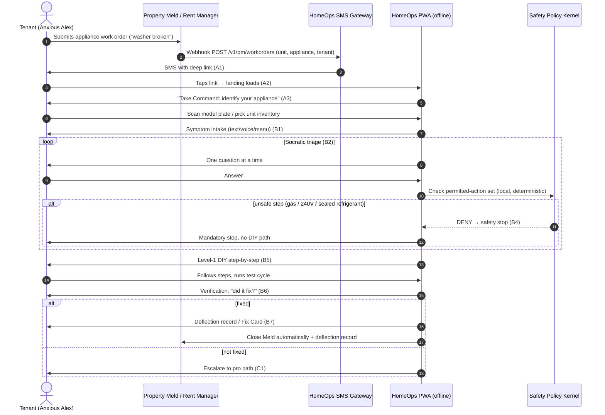
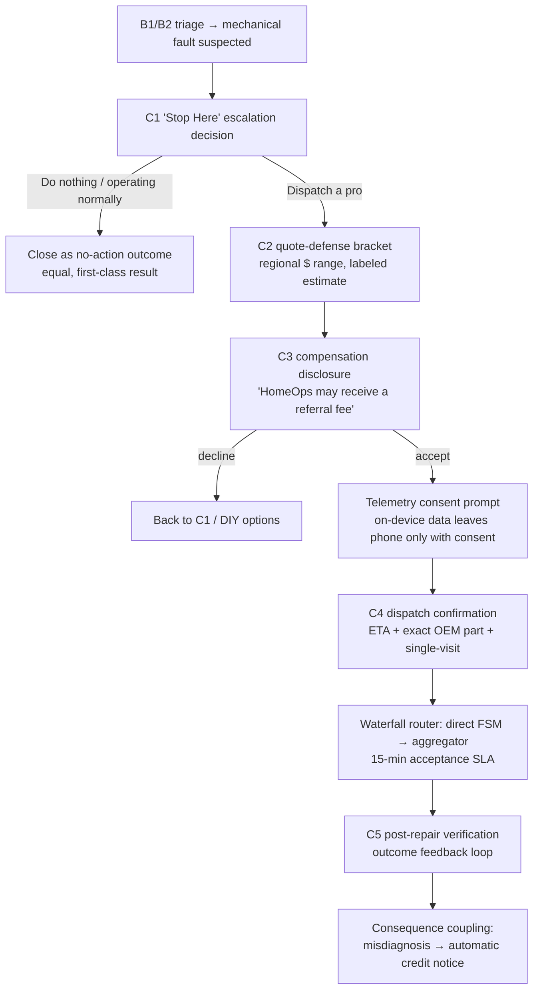
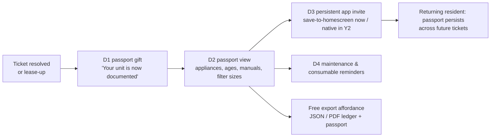
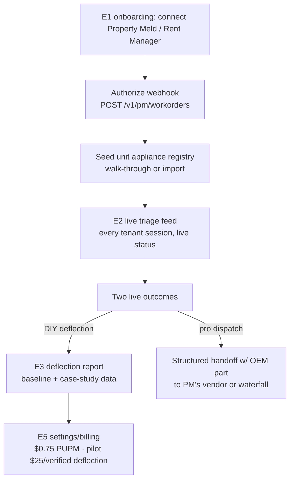

# HomeOps App Development Document — v1.0

**Version:** 1.0 (canonical build document)
**Date:** 2026-08-19
**Authors:** John (BMAD PM) + Sally (BMAD UX Director) — merged by Hermes
**Status:** Working Draft — for Sire review
**Supersedes:** `homeops-prd-v1.0.md` (archived 2026-08-19)

> **Binding context:** GTM Strategy Rev 3 (2026-08-19). Year 1 = **B2B2C wedge**: Property Meld / Rent Manager PM integrations + **SMS zero-install PWA** (no app store, no download). Native iOS/Android = **Year 2**. The broker-first React Native direction and PRD v1.0 are archived — do not build to them.

---

## Executive Synthesis (Hermes)

**The product in one sentence:** a tenant's appliance issue becomes a PM work order, which fires an SMS link to a zero-install PWA that triages the fault — safely deflecting what can be fixed (Level 1) and handing a pre-diagnosed, single-visit dispatch to a pro for what can't — then seeds a permanent Appliance Passport as the Move-In Bridge.

**The surface (24 screens, shared spine A1–E5):**
- **A · SMS Intake & Entry** — A1 SMS trigger → A2 PWA landing → A3 appliance ID (scan / manual / pre-seeded inventory)
- **B · Triage & Diagnostic** — B1 symptom intake → B2 Socratic triage → B3 error-code lookup → B4 deterministic safety stop → B5 DIY step-by-step → B6 verification → B7 tamper-evident Fix Card
- **C · Pro Dispatch Path** — C1 "Stop Here" (do-nothing = equal option) → C2 quote bracket → C3 compensation disclosure → C4 dispatch confirmation → C5 post-repair feedback
- **D · Move-In Bridge & Passport** — D1 passport gift → D2 passport view → D3 save-to-homescreen (native = Y2) → D4 maintenance reminders
- **E · PM Experience (web)** — E1 Property Meld onboarding → E2 live triage feed → E3 deflection report → E4 portfolio registry → E5 settings/billing

**Non-negotiables baked into every screen:** the 10-Point Trust Constitution (firewalled triage vs. monetization, no forced action, disclosed compensation, visible confidence scores, deterministic safety stops, free export, outcome feedback) and the banned-claims box (tamper-evident receipts, never zero-knowledge/immutable/error-free; CA = SB 244).

**The three blockers that stop the build (all documented as Open Questions):**
1. **OQ-01 · Property Meld webhook/API** — no sandbox = no A1 = no funnel. Single highest-priority unblock.
2. **OQ-07 · FTFR baseline ledger — RESOLVED 2026-08-21** — industry avg 75–80% (Aberdeen 2013/PTC 2024/IBM 2026); appliance-specific 68–74% (Exoserva 2026); broken/laggard band 60–65% (UASA). "40% NTF" disproven (imported avionics; honest appliance NTF ~15–25%). Use `homeops-ftfr-deep-dossier-2026-08-21.md` + `homeops-ntf-deep-provenance-dossier-2026-08-21.md` for case-study baselines.
3. **OQ-09 · C3 disclosure legal wording** — Trust Constitution #3 requires counsel-approved compensation disclosure before C4 can ship.

Full open-question list: §7 of the Product Spine (Part 1) — OQ-01 through OQ-12.

**Deliverables in this document:**
- **Part 1 — Product Spine** (John): scope/non-goals, JTBD, 24 feature specs with acceptance criteria, monetization map, metrics discipline, risks, 12 OQs.
- **Part 2 — UX Walkthrough** (Sally): UX principles, 5 Mermaid journey flows, complete screen inventory with ASCII wireframes, design system tokens, microcopy, Trust Constitution UI patterns, accessibility.
- **Part 3 — HTML Mockups** (Sally): 5 self-contained mobile-first hero screens in `homeops-pwa-html-mockups/` — A2 landing, B2 triage chat, B5 DIY step, C3 pro dispatch w/ disclosure, D2 passport.

**Recommended next step:** resolve OQ-01 (Property Meld sandbox) → Winston (Architect) pass on PWA tech architecture (WASM SQLite, offline, OCR/speech capability detection) → scaffold the repo → build A-path first.

---


# PART 1 — PRODUCT SPINE

# HomeOps PWA — Product Spine (Year 1)

**Version:** 1.0
**Date:** 2026-08-19
**Author:** John (BMAD PM)
**Status:** Working Draft

> **What this is:** the authoritative product spine for the HomeOps Year 1 build. It defines the Year 1 boundary, the user segments and their jobs, every feature on the shared screen spine A1–E5 (purpose, functional spec, safety gating, data captured, monetization touchpoint, acceptance criteria), the monetization map, pilot targets, risks, and open questions. It is the contract that Winston (Architect) designs to and Amelia (Dev) builds against.
>
> **What this is not:** a marketing deck, a legal memo, or a market-sizing exercise. Every number herein is classified **sourced fact / reproducible measurement / hypothesis** per GTM Rev 3 §8. No banned claim appears outside a "do not say / say instead" context.

---

## 0. Governing Rules (read once, apply everywhere)

Every requirement in §3 MUST satisfy all three:

1. **The 10-Point Trust Constitution (binding).** Firewalled diagnostic engine (#1), No Forced Action (#2), Disclosed Referral Compensation (#3), Equal Ranking (#4), On-Device Data Sovereignty (#5), Free Export (#6), Transparent Confidence Scores (#7), Conservative Safety Boundaries (#8), Outcome Feedback Loop (#9), Consequence Coupling (#10).
2. **Banned-claims discipline.** Never write: *zero-knowledge, immutable, error-free, fraud-proof, zero latency, proof of failure time, SB 542*. Say instead: *tamper-evident event receipt, schema-validated handoff, measured latency*. California R2R is **SB 244**, not SB 542.
3. **Number classification.** Every figure is tagged `[HYPOTHESIS]`, `[TARGET]`, `[SOURCE FACT]`, or `[MEASUREMENT]`. Unclassified numbers do not ship.

**Brand (applies to all tenant-facing copy and UI):** Deep Green `#005B5D`, White `#FFFFFF`, Light Gray `#F0F0F0`; font Inter; **agentive voice** ("Take Command: …" — calm, commanding, reassuring, action-oriented); corner brackets frame important zones; focus rings on all interactive elements (a11y); 8-pt grid.

---

## 1. Product Scope & Non-Goals (Year 1)

### 1.1 The Year 1 boundary — in one sentence

HomeOps Year 1 is a **B2B2C wedge**: a zero-install, SMS-triggered Progressive Web App that intercepts tenant appliance work orders flowing through a property manager's **Property Meld / Rent Manager** platform, resolves safe Level 1 issues through guided DIY deflection, and routes everything else into a pre-diagnosed pro dispatch — all while seeding the **Appliance Passport** that becomes the persistent product.

### 1.2 In scope (Year 1)

| # | Scope item | Notes |
|---|---|---|
| S1 | **SMS-triggered PWA** (zero-install, no app store) | Shell `<1.2 MB`, first load `<800 ms` `[MEASUREMENT — shell measured separately from model/OCR/speech/pack assets]`. |
| S2 | **PM work-order integration** | Property Meld webhook → SMS link (A1). Rent Manager is named as a second target; **Property Meld is the build-first platform.** |
| S3 | **Safe DIY deflection (Level 1)** | Filter/reset, lid-switch, inlet-screen, debris-filter, lint-trap, breaker-reset class fixes only. |
| S4 | **Pro dispatch (Level 2–4)** | Waterfall router: local FSM partner (Housecall Pro) → national aggregators (Dispatch.me / Puls). Exact OEM part identified before dispatch. |
| S5 | **Safety policy kernel** | Deterministic, model-external enforcement of Trust Constitution #8 (gas / 240V / sealed refrigerant → mandatory stop). |
| S6 | **Move-In Bridge / Appliance Passport** | Post-resolution or lease-up gift; permanent passport; persistent-app invite (save-to-homescreen). |
| S7 | **PM web dashboard** | Onboarding, live triage feed, deflection report, portfolio registry, settings/billing. |
| S8 | **DKM-v2 signed diagnostic packs** | Top-20 laundry + refrigeration families (180-day playbook). |

### 1.3 Out of scope (Year 1) — explicitly

| # | Non-goal | When / why |
|---|---|---|
| N1 | **Native iOS/Android app** | Year 2. Year 1 is PWA-only. The "install" call-to-action in Y1 is *save-to-homescreen*, never "download the app." |
| N2 | **Marketplace / contractor bidding** | No. Trust Constitution #4 (Equal Ranking) forbids paid placement; a bidding marketplace is a different product with different trust liabilities. Out of scope entirely for Y1. |
| N3 | **Broker walk-through / closing-gift flow** | The old broker-first PRD v1.0 is ARCHIVED. Broker persona (Realtor Rachel) is not a Y1 segment. |
| N4 | **Warranty carrier claims triage (Asurion/Frontdoor)** | Year 2. Referenced in strategy only. |
| N5 | **HOA/Condo Loss Shield** | Year 2. |
| N6 | **Consumer premium subscription ($4.99/mo)** | Year 3. |
| N7 | **OEM R2R telemetry data feeds** | Year 4–5. |
| N8 | **Edge hardware (BLE module / TinyML)** | Year 4–5. |
| N9 | **Quote-defense "bill auditor" for homeowners** | Year 3 consumer feature. The Year 1 quote *bracket* (C2) is a pre-dispatch range, not the consumer bill-auditor. |

### 1.4 What "built from scratch as a PWA" means (hard constraint)

The previous React Native/Expo direction is **archived**. No React Native, no Expo, no app store, no ML Kit (ML Kit is an Android/iOS SDK, **not a browser API**). The browser surface is:

- WASM SQLite in-browser (offline-first exact-match + FTS5 error-code lookup; performance to be measured — `[MEASUREMENT — benchmark harness with device/dataset/warm-cold/p50-p95-p99 required]`).
- `<input capture="environment">` for camera OCR of model plates — **capability-detected**, not a universal dependency.
- `webkitSpeechRecognition` for voice — **capability-detected**, sub-200 ms is an aspiration `[HYPOTHESIS]`, not a contract.
- Offline-first: triage works in a basement/utility room with no connectivity; telemetry syncs on consent.

---

## 2. User Segments & Jobs-to-be-Done

Three Year 1 segments. Note: the personas doc is **pre-alignment** — its SB 542 references, "error-free," "immutable," and "zero" claims are disregarded. Its persona *profiles* (Anxious Alex, Portfolio Patricia, Field Tech Frank) are retained as mental models only.

### 2.1 Segment A — Tenant in crisis (arriving via SMS)

**Hire statement:** *"When my appliance breaks and my landlord needs to know, help me figure out — right now, without downloading anything — whether I can fix it myself in five minutes, or get the right person here with the right part the first time."*

| Job type | Functional jobs | Emotional jobs |
|---|---|---|
| **Trigger moment** | Get a plain-language read on a cryptic error code or symptom. | Replace panic with control; feel I'm not at fault and not being upsold. |
| **Triage** | Be safely told "do this, stop here" without jargon. | Feel the machine (and my deposit) isn't at risk from my own hands. |
| **Resolution (DIY)** | Complete a safe Level 1 fix with step-by-step guidance and know it worked. | Feel competent; avoid a $150+ service fee for a lint filter. |
| **Resolution (pro)** | Get a single-visit repair with the right part, at a transparent regional price. | Feel I wasn't price-gouged; feel the wait won't be weeks. |
| **"Do nothing"** | Be allowed to say "it's actually fine" without penalty. | Feel no pressure — the system lets me *not* act (Trust #2). |
| **Export** | Pull my diagnostic ledger / passport in open format. | Feel I own my data (Trust #5, #6). |

### 2.2 Segment B — PM operator (triaging work orders)

**Hire statement:** *"When a tenant reports an appliance issue, help me route it correctly the first time — deflect the junk, hand my tech a pre-diagnosed ticket with the exact part — so I stop burning vendor invoices on filter clogs."*

| Job type | Functional jobs | Emotional jobs |
|---|---|---|
| **Intake** | Enrich vague tickets ("dishwasher broken") with model, serial, fault code. | Confidence that tickets stop wasting my staff's time. |
| **Routing** | Know, before dispatch, whether this is DIY-deflectable, tech-appropriate, or sealed-system. | Feel in control of OpEx, not guessing. |
| **Dispatch** | Hand Field Tech Frank a pre-diagnosed work order with the OEM part number. | Trust that Frank succeeds on visit one (FTFR). |
| **Asset registry** | Maintain unit-level appliance records (model/serial/age/warranty). | Confidence in repair-vs-replace CapEx decisions and deposit disputes. |
| **Reporting** | Show owners the deflection $ saved. | Prove my stewardship to asset owners (NOI). |

### 2.3 Segment C — PM admin / buyer

**Hire statement:** *"When I adopt a maintenance tool for my portfolio, help me see — in one dashboard — that it pays for itself, integrates with the platform I already run, and doesn't add a second maintenance workflow."*

| Job type | Functional jobs | Emotional jobs |
|---|---|---|
| **Adopt** | Integrate with Property Meld in a self-serve onboarding. | Feel this is low-risk (pilot is success-contingent). |
| **Measure** | See deflection rate, $ saved, FTFR — with baselines and confidence intervals. | Trust the numbers are real, not vendor math. |
| **Control** | Set billing ($0.75 PUPM), turn flows on/off, export data. | Feel I can leave anytime and take my data (Trust #6). |
| **De-risk** | Know triage is firewalled from monetization (Trust #1). | Confidence the platform isn't steering my tenants to bounties. |

**Explicit non-segment (Y1):** Realtor/Inspector (broker flow archived), Independent tech *as a buyer* (they're a *partner/supply-side*, not a customer — they receive dispatches, they don't pay for the PWA), warranty carrier, OEM.

---

## 3. Feature Requirements (Shared Screen Spine A1–E5)

**Legend for per-feature fields:**
- **Purpose** — why this screen exists and the job it serves.
- **Functional spec** — inputs / outputs / rules.
- **Safety gating (#8)** — how the deterministic safety boundary applies *on this screen*.
- **Data captured** — what is recorded, and where it lives (on-device vs. consented telemetry, per Trust #5).
- **Monetization touchpoint** — whether money moves here (if none: "None").
- **Acceptance criteria** — testable pass/fail.

---

### A. SMS Intake & Entry

#### A1 — SMS trigger (PM work order → PWA link)

- **Purpose:** Convert a Property Meld appliance work order into a tenant SMS containing a deep link to the PWA. This is the *entire* top of the funnel — no app store, no download.
- **Functional spec:**
  - **Input:** Property Meld webhook event `work_order.created` (or equivalent) with `property_id`, `unit_id`, `category ∈ {appliance}`, tenant phone/contact.
  - **Rules:** (1) only appliance-category tickets trigger; (2) if the unit has a pre-seeded appliance registry (E4), the link carries a unit-scoped token so A3 can offer "pick from your unit's inventory"; (3) SMS is sent via Twilio; (4) the link is single-purpose, short-TTL (e.g. 72h), and scoped to that work order — no tenant PII in the URL.
  - **Output:** SMS: *"Take Command: your {appliance} issue is queued. Open your HomeOps diagnostic in seconds — no download. {link}"*
- **Safety gating (#8):** None on this screen (no physical intervention). But the trigger MUST NOT auto-diagnose or auto-dispatch — it only opens intake.
- **Data captured:** work-order correlation ID, unit ID, category, timestamp (consented at E1 onboarding). Tenant contact data stays in the PM platform; HomeOps stores a hashed correlation, not raw contact lists.
- **Monetization touchpoint:** None (this is the funnel, not a billable event).
- **Acceptance criteria:** (a) A Property Meld appliance work order produces an SMS within **30 s** of webhook receipt; (b) the link opens the PWA without an app store; (c) non-appliance tickets do **not** trigger; (d) link is invalid after TTL and for the wrong unit.

> ⛔ **BLOCKER — OQ-01:** Property Meld webhook schema + API access are **not confirmed**. The entire A-path (and thus the whole product) is gated on this. Until we have a sandbox webhook + documented event schema, A1 is a contract against an unverified dependency.

#### A2 — PWA landing (calm authority, one-tap)

- **Purpose:** The first screen a panicked tenant sees. Its job is emotional: convert "my washer is broken" panic into "I'm being guided" — in under 800 ms, with one obvious action.
- **Functional spec:**
  - **Input:** deep-link token (from A1), device capability probe (OCR, speech, offline, storage).
  - **Output:** branded screen — Deep Green header, "HomeOps Diagnostic Assistant — Calm Authority Triage" (Intel-Inside model), a single primary CTA **"Start diagnosis"** (agentive voice), and a quiet "just want to report it to your manager?" secondary link (Never trap the tenant — Trust #2).
  - **Rules:** no account creation, no email wall, no upsell on the landing. Loads offline from cache after first visit.
- **Safety gating (#8):** None (no intervention). Landing must not display any diagnostic claim before triage.
- **Data captured:** capability probe result (device class, OCR/speech availability — capability flags, not telemetry), load timing (measured latency). On-device only.
- **Monetization touchpoint:** None.
- **Acceptance criteria:** (a) Shell `<1.2 MB` and first load `<800 ms` on a reference mid-tier Android device `[MEASUREMENT]`; (b) exactly one primary action; (c) no forced account/email gate; (d) renders offline on second visit.

#### A3 — Appliance identification (scan / manual / pre-seeded inventory)

- **Purpose:** Anchor the diagnosis to the *exact* model so error-code lookup and parts are correct — the single biggest driver of FTFR.
- **Functional spec:**
  - **Input:** one of — (1) camera OCR of the rating plate via `<input capture="environment">`; (2) manual entry of make/model; (3) pick from the unit's pre-seeded inventory (if E4 registry has it).
  - **Output:** confirmed `{make, model, serial-prefix}` resolved against the DKM catalog, with a confidence indicator (Trust #7 — show "model matched, 92%").
  - **Rules:** OCR is **capability-detected** — if unsupported, fall back to manual/inventory *without* degrading the flow (no dead-end). Serial is truncated to prefix for privacy (open schema). Model not found → manual category + manual entry path, never a hard block.
- **Safety gating (#8):** None. But a *mis-identified model* is a downstream safety hazard (wrong pack → wrong fix). Mitigation: model match is surfaced to the user for confirmation before any guided step; unresolved model forces a conservative (stop) posture, never an aggressive fix.
- **Data captured:** model/serial-prefix/category — stored on-device; enters the passport (D2) with consent. OCR runs on-device (ML Kit is NOT used; browser-native only).
- **Monetization touchpoint:** None directly — but this seeds the Appliance Passport asset that underpins retention (D) and Y2+ monetization.
- **Acceptance criteria:** (a) OCR path returns a resolved model on a clean plate image in the pilot device set; (b) manual + inventory paths complete without OCR support; (c) unresolved model → conservative posture (no guided fix issued); (d) confidence % shown.

---

### B. Triage & Diagnostic

#### B1 — Symptom intake (text / voice / menu)

- **Purpose:** Capture *what the tenant observes* in their own words, structured enough for the triage engine — without forcing jargon.
- **Functional spec:**
  - **Input:** free-text, `webkitSpeechRecognition` voice (capability-detected), or a symptom menu (common symptoms per category).
  - **Output:** a structured symptom statement + a captured fault code (if the machine shows one).
  - **Rules:** voice is an *optional enhancement*, never a required path. All three inputs normalize to the same structured symptom record.
- **Safety gating (#8):** **Active.** If the symptom statement contains a safety lexicon match (gas smell, burning, sparking, water + electricity, sealed-system/refrigerant) the engine routes **directly to B4**, bypassing conversational triage. This match is deterministic (lexicon/rule), not model-only.
- **Data captured:** raw symptom text/audio. **Audio stays on-device** (Trust #5); only the normalized text symptom (if consented) may leave. Audio is never transmitted for Y1.
- **Monetization touchpoint:** None. **Firewalled** (Trust #1): symptom data does not feed any bounty-ranking input.
- **Acceptance criteria:** (a) text + menu + (capability-permitting) voice all reach the same structured record; (b) safety-lexicon symptom → B4 with zero intervening steps; (c) audio never leaves the device (network-call assertion in tests).

#### B2 — Conversational triage (Socratic, safety-gated)

- **Purpose:** Narrow the candidate cause through calibrated questions while *continuously* enforcing the safety boundary — the "conversational" layer that is a presentation over the deterministic policy kernel.
- **Functional spec:**
  - **Input:** structured symptom (B1) + confirmed model (A3).
  - **Output:** one of three dispositions: `SAFE_DIY` (→ B5), `PRO_DISPATCH` (→ C1), `STOP` (→ B4). Plus a candidate cause with a **visible confidence %** (Trust #7, e.g. "likely cause: clogged drain filter — 82%").
  - **Rules:** Socratic questioning (closed, one-at-a-time questions). The SLM/RAG is a **replaceable presentation layer** — it never authorizes an action; the policy kernel does. If the SLM is absent/unsupported, the flow runs in **model-free safe mode** (menu-driven) with the same gating.
- **Safety gating (#8):** **Active and model-external.** The permitted-action set is computed by the deterministic policy kernel; any step touching gas lines / 240V / sealed refrigerant → **B4 mandatory stop**, with no language-model override. Confidence scores are calibrated (distinguish *confirmed observation* from *inferred cause* — show "observed: fault code E2 F4" separately from "inferred: drain-pump jam").
- **Data captured:** question/answer trace, candidate-cause chain, confidence values. On-device; exportable (Trust #6); telemetry only with consent.
- **Monetization touchpoint:** None. **Firewalled** (Trust #1): the triage tree is isolated from the monetization router; a `SAFE_DIY` outcome is *never* escalated to pro to generate a bounty.
- **Acceptance criteria:** (a) every path ends in exactly one disposition; (b) a `SAFE_DIY` recommendation is produced for a known Level 1 fault in the pilot pack set; (c) injecting a gas/240V/sealed lexicon term forces B4 even if the SLM suggests DIY (deterministic override test); (d) confidence % visible on the result.

#### B3 — Error-code lookup + plain-language explainer

- **Purpose:** Turn a cryptic code ("5C", "E2 F4", "OE") into plain language the tenant actually understands — the "aha" moment that builds trust.
- **Functional spec:**
  - **Input:** fault code (from B1/B2) + model (A3).
  - **Output:** plain-language explanation ("This usually means the drain can't clear — often a filter or a kinked hose") + a non-technical next step.
  - **Rules:** WASM SQLite in-browser — offline-first exact-match + FTS5 lookup `[MEASUREMENT — benchmark harness required]`. Offline-first: lookup works with no network. No lookup result → "we couldn't match this code on-device" + conservative next step (never a fabricated explanation).
- **Safety gating (#8):** If the code maps to a gas/240V/sealed-system class, the explainer **must not** suggest a DIY step and must surface B4.
- **Data captured:** code + explanation served (on-device pack). No telemetry required to serve this.
- **Monetization touchpoint:** None.
- **Acceptance criteria:** (a) a known pilot code returns a correct plain-language explanation offline; (b) unknown code → honest "no match" with conservative guidance, not a hallucinated fix; (c) lookup latency within the measured benchmark envelope.

#### B4 — Safety stop screen (mandatory)

- **Purpose:** The hard wall. When a step involves gas / 240V / sealed refrigerant, the app stops the DIY path and routes to pro — enforced **deterministically**, never by a natural-language warning alone (Trust #8).
- **Functional spec:**
  - **Input:** any trigger from B1/B2/B3 that hits the safety boundary.
  - **Output:** a full-stop screen: corner-bracketed warning zone, agentive copy ("Take Command: stop here — this one needs a licensed pro"), and the pro path (C1) as the only forward action. No DIY steps are reachable from this screen.
  - **Rules:** deterministic. The stop is produced by the policy kernel, not the SLM. "Do nothing" (Trust #2) remains an equal, visible option.
- **Safety gating (#8):** **This screen *is* #8.** It must be reachable from B1/B2/B3/B5 and must be impossible to bypass in the UI (no "I know what I'm doing" override for gas/240V/sealed in Y1).
- **Data captured:** safety-stop event (reason class, timestamp) — on-device, exportable; this is a *tamper-evident diagnostic event receipt* (not "proof of failure time").
- **Monetization touchpoint:** The downstream pro dispatch (C4) may earn a bounty — **the stop itself earns nothing.** The stop-to-bounty relationship is one-directional and disclosed at C3 (Trust #3).
- **Acceptance criteria:** (a) gas/240V/sealed trigger → B4 with zero DIY steps available; (b) no UI override exists for the boundary; (c) "Do nothing" is presented as an equal option; (d) stop event is recorded and exportable.

#### B5 — DIY deflection step-by-step (Level 1 only)

- **Purpose:** Guide the tenant through a *safe* Level 1 fix (filter/reset/lid-switch/inlet-screen/lint/breaker class) with enough structure to succeed on the first try — this is where the $150 truck roll is actually avoided.
- **Functional spec:**
  - **Input:** `SAFE_DIY` disposition from B2 + model (A3) + the specific Level 1 procedure from the DKM pack.
  - **Output:** a step-by-step procedure (numbered, one step per screen, with photos/illustrations and "done / not sure" confirmation per step), ending in a verification prompt (B6).
  - **Rules:** Level 1 scope is **closed and enumerated** (filter clean, reset, door/lid switch check, water-inlet screen, lint trap, breaker). No panel removal beyond user-serviceable access, no live-voltage probing, no sealed-system touch. If a step is "not sure," the flow conservatively exits to C1 — never guesses past a tenant's uncertainty.
- **Safety gating (#8):** **Active.** Each step carries a pre-computed permitted-action tag from the policy kernel; a step that falls outside Level 1 is not renderable. Any gas/240V/sealed tangent → B4.
- **Data captured:** step completions, "done/not sure" outcomes — on-device ledger; this is the raw material for the deflection record (B7) and, with consent, the case-study evidence.
- **Monetization touchpoint:** None *at the moment of the fix* — the fix is **firewalled** from monetization (Trust #1). The $25/deflected dispatch is billed only off the *verified* outcome (B6→B7), and the engine that *decided* to offer DIY is isolated from the router that *would have* earned a bounty.
- **Acceptance criteria:** (a) a pilot-pack Level 1 fault resolves via the guided steps in the pilot environment; (b) every step carries a permitted-action tag; (c) "not sure" at any step exits to C1, not to a forced completion; (d) a non-Level-1 step cannot be rendered.

#### B6 — Verification (did it fix it?)

- **Purpose:** Confirm the fix actually worked — the outcome signal that makes deflection *real* (Trust #9's pre-condition) and prevents a false "deflected" that just kicks the can.
- **Functional spec:**
  - **Input:** completion of B5 steps.
  - **Output:** a short verification — run a test cycle / check the symptom is gone — with **three** first-class outcomes: `RESOLVED`, `NOT_RESOLVED`, `DO_NOTHING` (machine is actually fine / intermittent). No outcome is deprioritized (Trust #2).
  - **Rules:** verification is *required* to claim a deflection. `NOT_RESOLVED` or `DO_NOTHING` → C1 (or close), not counted as deflection.
- **Safety gating (#8):** None new (the fix is already bounded by B5); the verification must not *introduce* a new step that crosses the boundary.
- **Data captured:** outcome + timestamp — on-device; this is the tamper-evident event receipt backbone (hash-chained where supported — "tamper-evident," never "immutable").
- **Monetization touchpoint:** **This is the billable gate.** A `RESOLVED` outcome is the prerequisite for a `$25/deflected dispatch` (pilot) invoice to the PM. `NOT_RESOLVED`/`DO_NOTHING` bill nothing.
- **Acceptance criteria:** (a) all three outcomes are reachable and presented as equals; (b) a `RESOLVED` result can be distinguished from `NOT_RESOLVED` in the data model; (c) verification is mandatory before any deflection is counted.

#### B7 — Deflection record / Fix Card (tamper-evident event receipt)

- **Purpose:** Produce the artifact that (a) closes the loop with the tenant, (b) auto-closes the Meld work order, and (c) is the invoice-grade evidence for the $25 pilot.
- **Functional spec:**
  - **Input:** `RESOLVED` verification (B6) + the procedure trace (B5) + model (A3).
  - **Output:** a **Fix Card** — corner-bracketed summary: what was wrong (plain language), what was done, the confidence of the diagnosis (Trust #7), an **estimated** savings figure labeled **"estimate"** (e.g. *"estimated $150–$220 dispatch saved — estimate, not a guarantee"*), and the tamper-evident event receipt.
  - **Rules:** the savings figure is a *range* with "estimate" labeling `[HYPOTHESIS — needs baseline + CI]`. The receipt is **tamper-evident** (hash-chained event receipt) — never "immutable," never "proof of failure time." A "Close this ticket with your manager" action auto-closes the Meld order via webhook.
- **Safety gating (#8):** None new; inherits B5/B6 bounds.
- **Data captured:** the deflection record (tamper-evident receipt, procedure trace, outcome, estimate) — on-device + (consented) the PM-facing report (E3). Free export (Trust #6).
- **Monetization touchpoint:** **Invoice anchor.** The PM is billed `$25/verified deflected dispatch` (pilot, success-contingent) off this record. The tenant is never charged.
- **Acceptance criteria:** (a) Fix Card renders with confidence % + "estimate" label on the $ figure; (b) receipt is exportable in open JSON/PDF (Trust #6); (c) "close ticket" triggers the Meld close webhook; (d) no banned-claim phrasing anywhere in the card.

---

### C. Pro Dispatch Path

#### C1 — "Stop Here" escalation decision (Do nothing = equal option)

- **Purpose:** The honest handoff. When the tenant can't or shouldn't DIY, present escalation *and* "do nothing / it's actually operating normally" as equal, first-class options (Trust #2) — then let them choose.
- **Functional spec:**
  - **Input:** `PRO_DISPATCH` / `NOT_RESOLVED` / `STOP` / `DO_NOTHING` dispositions.
  - **Output:** a decision screen: **"Route a pro"** (→ C2) and **"Do nothing / report it's fine"** (closes without dispatch) — visually equal weight, no dark pattern nudging toward the paid path.
  - **Rules:** the escalation is *tenant-elected* for non-safety stops; for **B4 safety stops**, "route a pro" is strongly recommended but "do nothing" must still not be hidden (a tenant may decline service and call their own pro).
- **Safety gating (#8):** For safety stops, this screen must carry the safety rationale forward ("this needs a licensed pro because it involves sealed refrigerant") — disclosure, not coercion.
- **Data captured:** tenant's election (route vs. do-nothing) — on-device, consented to PM feed (E2).
- **Monetization touchpoint:** None at the decision. A "route a pro" election is a *precondition* for the bounty (C4), but the decision itself earns nothing — and a "do nothing" is never monetized.
- **Acceptance criteria:** (a) "route a pro" and "do nothing" render with equal visual prominence; (b) no pre-selected default; (c) safety stops carry the safety rationale forward; (d) do-nothing election never triggers a bounty.

#### C2 — Quote-defense bracket (regional range)

- **Purpose:** Give the tenant *information leverage* before authorizing labor — a dated regional price range so they're not entering the repair blind.
- **Functional spec:**
  - **Input:** category + model + candidate cause + ZIP (region).
  - **Output:** a quote bracket: a **dated range with source, region, included services, tax/travel/diagnostic-fee assumptions, urgency, labor-time confidence, and comparable count** — never a single "fair price" verdict, never "price gouging / inflated" language `[HYPOTHESIS — regional data source TBD, see OQ]`.
  - **Rules:** if regional data is unavailable for the ZIP, show "regional benchmark unavailable — we'll show your pro's quote before you commit" rather than a fabricated range. This is **not** the Year 3 consumer bill-auditor.
- **Safety gating (#8):** None (informational). The bracket must not imply a diagnosis is certain; it's a planning aid.
- **Data captured:** ZIP (region) + bracket shown — on-device; region-level, not street-level, telemetry (Trust #5).
- **Monetization touchpoint:** None in Y1 (the bracket is a trust/retention feature, not a paid product).
- **Acceptance criteria:** (a) bracket shows a dated range with source + region + comparables; (b) no bracket data → honest fallback, no fabricated number; (c) no "gouging/inflated" verdict language.

#### C3 — Compensation disclosure (bounty disclosed)

- **Purpose:** Fulfill Trust Constitution #3 — *every* pro handoff discloses that HomeOps earns partner compensation when a pro is dispatched. Non-negotiable; a hard blocker if omitted.
- **Functional spec:**
  - **Input:** n/a (static disclosure, triggered by pro-path entry).
  - **Output:** a plain-language disclosure: *"If you book through HomeOps, HomeOps may receive a referral fee from the service provider. This doesn't change your price."* (Exact wording approved at build; must be prominent, not buried in fine print.)
  - **Rules:** shown **before** the tenant commits to a dispatch (C4), not after. The disclosure must also state that DIY recommendations are **not** driven by referral economics (Trust #1) — reinforce the firewall.
- **Safety gating (#8):** None; governance (#3) not safety.
- **Data captured:** disclosure-acknowledged flag — on-device + consented.
- **Monetization touchpoint:** This is where the bounty **is disclosed**, not earned. It is the trust-cost of the C4 revenue.
- **Acceptance criteria:** (a) disclosure renders before C4 confirmation; (b) it is prominent and plain-language; (c) it states DIY is not bounty-driven; (d) legal sign-off on exact wording (OQ).

#### C4 — Dispatch confirmation (ETA, exact part, single-visit)

- **Purpose:** Convert the pre-diagnosis into a single-visit repair — the exact OEM part identified *before* dispatch, so the tech arrives ready (the FTFR engine).
- **Functional spec:**
  - **Input:** tenant consent (post-C3) + pre-diagnosis (cause, confidence, exact OEM part #) + ZIP.
  - **Output:** dispatch confirmation: ETA, the exact part identified, "single-visit" expectation, and the confirmed provider.
  - **Rules:** **Waterfall router** — (1) check local ZIP for a direct FSM partner (Housecall Pro) with a 15-min acceptance SLA; (2) on no-partner/timeout, cascade to national aggregators (Dispatch.me / Puls). The part number is included in the dispatch payload. Confidence % (Trust #7) travels with the handoff. The handoff envelope is **schema-validated, fail-closed** (never "error-free").
- **Safety gating (#8):** B4-originated dispatches carry the safety reason; the router must not allow a gas/240V/sealed job to route to a non-licensed provider class (license-scope check on the provider record).
- **Data captured:** dispatch payload (cause, confidence, part, evidence references E0–E4, completed steps, pack version, policy result) — the **signed, privacy-filtered, idempotent handoff envelope**. Consented.
- **Monetization touchpoint:** **Earns the bounty.** `$75–85` direct FSM / `$50–65` aggregator, blended `$55–75` pro forma `[HYPOTHESIS — partner economics; not a coverage guarantee]`. Bounty is paid by the *provider/network* to HomeOps; the tenant is never surcharged (see C3).
- **Acceptance criteria:** (a) direct-FSM → aggregator cascade with 15-min SLA works end-to-end in a test market; (b) exact OEM part # present in the dispatch payload; (c) handoff is schema-validated and fails closed on malformed payload; (d) license-scope check blocks an unlicensed provider on a safety-class job; (e) confidence % present in the payload.

#### C5 — Post-repair verification (outcome feedback loop)

- **Purpose:** Close the loop (Trust #9): confirm the diagnosis and part actually resolved the issue — the data that *calibrates* everything (FTFR, confidence scores, misdiagnosis detection) and arms the misdiagnosis credit (Trust #10).
- **Functional spec:**
  - **Input:** post-dispatch (prompt after the ETA window / provider-close signal).
  - **Output:** a short verification ("did the fix resolve it?") with outcomes `RESOLVED` / `NOT_RESOLVED`, feeding the FTFR calculation and the feedback loop.
  - **Rules:** verification is *required* for the dispatch to be counted as a completed FTFR data point. A `NOT_RESOLVED` triggers the consequence path (Trust #10).
- **Safety gating (#8):** None (post-repair, informational).
- **Data captured:** outcome + provider + part — on-device + consented (this is the calibration gold).
- **Monetization touchpoint:** **Consequence Coupling (#10).** If HomeOps *misdiagnosed* leading to an unnecessary part purchase, an automatic credit is issued (credit ≠ admission of legal liability). Bounty reconciliation may depend on confirmed resolution (partner-contract dependent).
- **Acceptance criteria:** (a) post-repair prompt fires within the ETA window + grace; (b) outcome feeds FTFR and confidence calibration; (c) misdiagnosis → automatic credit path exists and is exercised in test.

---

### D. Move-In Bridge & Appliance Passport

#### D1 — Passport gift (post-resolution / lease-up)

- **Purpose:** Convert a crisis interaction into a durable relationship — the "Move-In Bridge." After the ticket resolves (or at lease-up), the tenant receives their permanent Appliance Passport.
- **Functional spec:**
  - **Input:** resolution (B7 or C5) or lease-up trigger from the PM.
  - **Output:** a branded passport gift message: *"Take Command: your unit's appliances are now documented in your HomeOps Passport."*
  - **Rules:** delivered post-resolution (never interrupting a live crisis); free; optional to accept (no forced retention).
- **Safety gating (#8):** None.
- **Data captured:** passport grant event (consented).
- **Monetization touchpoint:** None in Y1. This seeds the persistent-app base for Y2 native + Y3 consumer monetization (a *retention* asset, not a billable event).
- **Acceptance criteria:** (a) gift fires post-resolution, not mid-crisis; (b) tenant can decline without penalty; (c) passport is populated from the unit registry (A3/E4).

#### D2 — Passport view (appliances, ages, manuals)

- **Purpose:** The durable value: a tenant-visible registry of their unit's appliances — model, age, manuals, warranty — the "household memory" that fights the low-frequency trap.
- **Functional spec:**
  - **Input:** the unit's appliance registry (from A3/E4).
  - **Output:** passport view listing each appliance with model, serial-prefix, estimated age, manual access, and a one-tap "diagnose this appliance."
  - **Rules:** on-device first; manuals served from the DKM pack (offline). Age is an *estimate* where install date is unknown.
- **Safety gating (#8):** None (informational).
- **Data captured:** passport contents — on-device, **exportable in open JSON/PDF** (Trust #6).
- **Monetization touchpoint:** None.
- **Acceptance criteria:** (a) passport lists all unit appliances with model + age + manual; (b) offline manual access works; (c) full export in open JSON/PDF.

#### D3 — Persistent app invite (save-to-homescreen now; native install Y2)

- **Purpose:** Bridge the PWA→persistent gap *without* an app store. Year 1 invites "save to homescreen"; Year 2 invites native install.
- **Functional spec:**
  - **Input:** passport accepted (D1).
  - **Output:** a save-to-homescreen prompt (PWA install) with agentive copy. **No "download the app" language in Y1** (there is no app).
  - **Rules:** the invite is contextual and dismissible; the PWA must satisfy installability criteria (manifest + service worker + HTTPS).
- **Safety gating (#8):** None.
- **Data captured:** install/save event (consented).
- **Monetization touchpoint:** None (sets up Y2 native + Y3 premium).
- **Acceptance criteria:** (a) PWA is installable (manifest/service worker/HTTPS); (b) invite copy says "save to homescreen," never "download"; (c) dismissible without penalty.

#### D4 — Maintenance / consumables reminders

- **Purpose:** Build habit and retention between failures — filter changes, lint cleanout, anode-rod timing — so the passport is used *between* crises.
- **Functional spec:**
  - **Input:** appliance records (D2) + consumable schedules from DKM packs.
  - **Output:** reminders (in-app / optional push) for consumables tied to installed models.
  - **Rules:** notifications are **opt-in** (Trust #5); schedules are model-based `[HYPOTHESIS — needs validation]`, labeled as guidance, not warranty.
- **Safety gating (#8):** None (reminders are informational; no physical guidance beyond Level 1 is implied).
- **Data captured:** reminder preferences + completion marks — on-device.
- **Monetization touchpoint:** None in Y1. This is the seed for Y3 consumables fulfillment (which carries the 8% parts rev-share) — do **not** monetize reminders in Y1 (keeps the firewall clean).
- **Acceptance criteria:** (a) reminders are opt-in; (b) model-based schedule renders for a pilot appliance; (c) no monetization touchpoint in Y1.

---

### E. PM Experience (Web Dashboard)

#### E1 — Onboarding / integration (Property Meld webhook)

- **Purpose:** Get the PM live with the minimum possible lift — connect Property Meld, seed the registry, start the pilot.
- **Functional spec:**
  - **Input:** PM credentials / API key + Property Meld connection; portfolio import.
  - **Output:** connected integration (A1 webhook armed), initial portfolio registry (E4), pilot terms (success-contingent $25/deflection → $0.75 PUPM conversion).
  - **Rules:** self-serve where possible; the "Zero-Risk Pilot" is 60-day / 300–500 units; success-contingent pricing is a **contract term**, not a "100% success" guarantee.
- **Safety gating (#8):** None (admin surface, no tenant intervention).
- **Data captured:** org/portfolio metadata, integration credentials (encrypted at rest), consent to data processing (Trust #5 telemetry consent for PM-side).
- **Monetization touchpoint:** **Contract origination.** The pilot agreement (and later the $0.75 PUPM SaaS) is executed here.
- **Acceptance criteria:** (a) a test PM can connect Property Meld and arm the webhook in <1 hour unassisted; (b) portfolio import populates E4; (c) pilot terms are explicit and success-contingent.

> ⛔ **BLOCKER — see OQ-01:** E1 is blocked on the same Property Meld API/webhook confirmation as A1.

#### E2 — Live triage feed

- **Purpose:** Give the PM operator a real-time view of active tenant triage sessions and their disposition — so a tech can be pre-staged or a ticket closed without back-and-forth.
- **Functional spec:**
  - **Input:** consented triage events from tenant sessions.
  - **Output:** a live feed: unit, appliance, symptom, disposition (`DIY` / `PRO` / `STOP` / `DO_NOTHING`), confidence %, and status.
  - **Rules:** tenant telemetry shown here **requires explicit consent** (Trust #5). The feed shows outcome/status, not raw symptom audio or full chat transcripts (privacy filter). Feed is read-only (operators can route, not alter the diagnosis).
- **Safety gating (#8):** Read-only on diagnosis; the feed must not expose a path that re-opens a safety stop as a DIY step.
- **Data captured:** consented triage summary events (schema-validated).
- **Monetization touchpoint:** None.
- **Acceptance criteria:** (a) a tenant session appears in the feed with disposition + confidence; (b) only consented data appears; (c) feed is read-only on diagnostic content; (d) no raw audio/transcript exposure.

#### E3 — Deflection report (case-study data, baselines)

- **Purpose:** Prove the value — deflection rate, $ saved, FTFR — with **baselines and confidence intervals**, so the PM can justify the platform to owners. This is also the raw material for the co-published case study.
- **Functional spec:**
  - **Input:** aggregated (consented) deflection + dispatch + outcome data.
  - **Output:** a report: deflection rate, FTFR, $ saved per deflection — each with **denominator, baseline, and CI** `[TARGET/HYPOTHESIS — see §5]`. Every number classified; no unclassified number renders.
  - **Rules:** report only *measured* figures; `$150 saved/deflection` is shown as a **pilot estimate with baseline + CI**, never a flat "we save you $150." The FTFR number must resolve the 40–50% / 50–60% / 85–95% inconsistency (single baseline + denominator) before any external claim.
- **Safety gating (#8):** None.
- **Data captured:** aggregated, de-identified (not "anonymized" without a documented assessment) reporting rollups.
- **Monetization touchpoint:** **Invoice rollup.** The $25/deflected dispatch line-items aggregate here; this report is the invoice backing.
- **Acceptance criteria:** (a) every reported metric carries denominator + baseline + CI (or renders "insufficient data"); (b) $ saved is labeled estimate; (c) no banned claims; (d) FTFR uses a single authoritative baseline.

#### E4 — Portfolio appliance registry

- **Purpose:** The PM's unit-level asset ledger — model, serial, age, warranty — powering A3 pre-seeding, CapEx repair-vs-replace, and deposit disputes.
- **Functional spec:**
  - **Input:** portfolio import (E1) + on-site walk-through scans (tech captures rating plates) + tenant A3 resolutions.
  - **Output:** a searchable registry: property/unit → appliances → model/serial-prefix/age/warranty/manual.
  - **Rules:** serial truncated to prefix; age estimated where install date unknown; warranty status where known. Exportable (Trust #6).
- **Safety gating (#8):** None.
- **Data captured:** portfolio appliance metadata (org-owned).
- **Monetization touchpoint:** None directly — but the registry is the asset that makes $0.75 PUPM defensible and is a prerequisite for the passport (D2).
- **Acceptance criteria:** (a) registry populated on import + scan; (b) unit-scoped token powers A3 pre-seeding; (c) exportable.

#### E5 — Settings / billing ($0.75 PUPM)

- **Purpose:** Give the PM admin control over the commercial relationship — billing, consent toggles, data export, and the off-ramp.
- **Functional spec:**
  - **Input:** org settings.
  - **Output:** billing at **$0.75 per unit per month** `[HYPOTHESIS — pricing target]`; success-contingent pilot terms pre-conversion; consent toggles; full data export (Trust #6).
  - **Rules:** billing is transparent, line-itemed, and cancellation-friendly. Data export must include the diagnostic ledger + registry in open format. The off-ramp is a first-class action (no lock-in).
- **Safety gating (#8):** None.
- **Data captured:** billing records, consent state, export logs.
- **Monetization touchpoint:** **The SaaS revenue stream.** $0.75 PUPM is the recurring core; parts rev-share (8%) reconciles here in later phases (not a Y1 line-item on this screen until the parts cart ships).
- **Acceptance criteria:** (a) $0.75 PUPM billed correctly against unit count; (b) pilot→SaaS conversion terms explicit; (c) full export in open format; (d) cancellation completes cleanly.

---

## 4. Monetization Map (all labeled hypotheses)

> Every figure below is `[HYPOTHESIS]` unless tagged otherwise. No number ships without this label (GTM §8). The map shows **where money changes hands in each flow** and **who pays whom**.

### 4.1 The four Year 1 revenue mechanics

| # | Mechanic | Who pays | Who receives | Trigger point | Amount | Classification |
|---|---|---|---|---|---|---|
| M1 | **Deflected-dispatch fee (pilot)** | PM (property manager) | HomeOps | B6 `RESOLVED` → B7 record | **$25 / verified deflected dispatch** | `[HYPOTHESIS — success-contingent pilot pricing]` |
| M2 | **PM SaaS** | PM (post-pilot, contracted) | HomeOps | E5 monthly billing | **$0.75 / unit / month** | `[HYPOTHESIS — pricing target]` |
| M3 | **Dispatch bounty** | Provider / aggregator network | HomeOps | C4 dispatch confirmation (or completion, partner-dependent) | **$75–85 direct FSM · $50–65 aggregator · $55–75 blended** | `[HYPOTHESIS — partner economics; not a coverage guarantee]` |
| M4 | **Parts cart rev-share** | Parts distributor (Marcone / Parts Town) | HomeOps | Parts cart click-through on pro dispatch (C4) / later DIY | **8% take rate** (~$5.20 on $65 AOV) | `[HYPOTHESIS — affiliate terms; 8% contractual, $65 AOV is market estimate]` |

> **Bounty range note:** the task brief cites "$55–85"; the GTM waterfall enumerates $75–85 (direct FSM) and $50–65 (aggregator), with a $55–75 blended pro forma. Treat **$55–85 as the umbrella** and the sub-ranges as the source of truth until a canonical numbers ledger pins one authoritative range. **Flagged as an open inconsistency — see OQ-02.**

### 4.2 Where money changes hands, by flow

| Flow | Screen(s) | Money event | Party |
|---|---|---|---|
| Tenant resolves via DIY | B5 → B6 → B7 | M1: $25/deflection billed to PM (tenant pays $0) | PM → HomeOps |
| Tenant routes a pro | C1 → C3 → C4 | M3: bounty earned from provider/network (tenant pays the provider, disclosed at C3) | Provider → HomeOps |
| Parts are needed | C4 (+ later DIY) | M4: 8% rev-share on parts cart | Distributor → HomeOps |
| Recurring platform use | E5 | M2: $0.75 PUPM (post-pilot) | PM → HomeOps |

### 4.3 The firewall (Trust #1) — how monetization is *kept honest*

- The **diagnostic engine (A3, B1–B6)** and the **monetization router (C4, M1/M3)** are **model-external isolated**. Compensation inputs are kept separate from diagnostic-policy inputs.
- A `SAFE_DIY` recommendation is **never** escalated to pro to generate a bounty. The engine that decides "this is a filter" does not know the bounty rate.
- "Do nothing" (Trust #2) is **never** monetized.
- Every pro handoff discloses compensation (C3 = Trust #3); ranking is by proximity/certification/FTFR only, with **no paid placement** (Trust #4).

### 4.4 What is *deliberately not* monetized in Y1

| Item | Not monetized because |
|---|---|
| The quote bracket (C2) | Trust/retention feature; monetizing it would create a pricing-incentive conflict. |
| The passport (D1–D4) | Retention asset seeding Y2/Y3; charging now kills adoption. |
| Reminders (D4) | Consumables monetization is Y3; monetizing Y1 breaks the firewall. |
| "Do nothing" outcomes | Trust #2. |
| Any diagnostic data itself | Not sold in Y1 (and OEM telemetry is Y4–5, de-identified, consented). |

---

## 5. Metrics & Pilot Targets

> **Hard rule:** deflection rate and FTFR are **`[TARGET]`s, not results.** They are the figures the 180-day playbook *targets* (§10: ≥25% deflection, ≥80% FTFR). They are not validated outcomes and must never be published as such.

| Metric | Year 1 pilot target | Classification | Definition (must be frozen) |
|---|---|---|---|
| **Deflection rate** | **≥ 25%** | `[TARGET]` | `# of tenant work orders closed via DIY resolution (B6 RESOLVED) / # of appliance work orders entering triage`, over a defined observation window, per portfolio. |
| **First-Time Fix Rate (FTFR)** | **≥ 80%** | `[TARGET]` | `# of pro dispatches resolved on visit one (C5 RESOLVED, no re-visit) / # of completed pro dispatches`. |
| **$ saved per deflection** | **$150** (per-deflection estimate) | `[HYPOTHESIS — requires baseline + CI]` | Measured as avoided truck-roll cost vs. a **baseline** (control or pre-pilot) with a **confidence interval**. *Not* a flat claim. |
| **Case-study savings** | $7.5k PM savings/month | `[HYPOTHESIS — pilot measurement]` | Derived; requires the same baseline + CI discipline. |

### 5.1 Explicit measurement discipline (from GTM §8)

- **Freeze definitions + denominators before the pilot.** The §8 inconsistency flag on FTFR (40–50% / 50–60% / 85–95%) is a **blocking open item**: a single authoritative baseline + denominator + CI is required before *any* external deck.
- **$150/deflection** is reported as a *range with CI against a baseline*, never a bare number.
- **PWA performance** (`<1.2 MB`, `<800 ms`) plus lookup latencies are `[MEASUREMENT]`s requiring a benchmark harness (device matrix, dataset, warm/cold, p50/p95/p99).

---

## 6. Risks & Mitigations

### 6.1 Technical

| Risk | Severity | Mitigation |
|---|---|---|
| **PWA offline/WASM support matrix** — WASM SQLite, `<input capture="environment">` OCR, and `webkitSpeechRecognition` are uneven across browsers/devices; OCR and speech are **capability-detected**, not universal. | High | Capability probe at A2; graceful fallbacks (manual/inventory for OCR, text/menu for voice); model-free safe mode when SLM unavailable; test on the pilot device matrix (reference mid-tier Android + iOS Safari). |
| **Offline-first correctness** — triage in a basement with no connectivity; sync + pack freshness. | Medium | Offline-first storage (WASM SQLite) with consent-gated sync; DKM packs cached on-device; versioned packs with signed updates (DKM-v2). |
| **Safety kernel correctness** — a missed gas/240V/sealed boundary is a real injury risk. | Critical | Deterministic, model-external policy kernel (Trust #8); enumerated Level 1 scope; penetration/override tests in CI; B4 unreachable-by-design for boundary steps. |
| **Dispatch API integration** — Dispatch.me/Puls/Housecall Pro APIs unconfirmed; coverage network-dependent. | High | Waterfall router with honest "no provider in your area" fallback; treat coverage as network-dependent, not guaranteed (OQ-04). |

### 6.2 Business

| Risk | Severity | Mitigation |
|---|---|---|
| **PM platform dependence** — the entire funnel is gated on Property Meld webhooks. One API change kills A1/E1. | Critical | Build-first on Property Meld but architect the intake as a platform-agnostic webhook adapter; name Rent Manager as the second target; don't hard-code a single vendor schema. |
| **Pricing is all hypothesis** — $25/deflection, $0.75 PUPM, bounties, 8% rev-share are unvalidated. | High | Success-contingent pilot (60-day, 300–500 units); label everything; validate in pilot before any contracted SaaS pricing. |
| **Bounty economics** — $55–85 may not cover the value of a pre-diagnosed lead, or may compress. | Medium | Measure partner-side FTFR uplift to justify the bounty; keep ranges partner-negotiated. |
| **FTFR/deflection targets not met** — if deflection <25% or FTFR <80%, the wedge story weakens. | High | Baselines + CIs from day 1; iterate DKM pack coverage; report honestly rather than cherry-pick. |

### 6.3 Trust

| Risk | Severity | Mitigation |
|---|---|---|
| **Firewall breach** — triage steered toward bounties (Trust #1). | Critical | Model-external isolation; compensation inputs firewalled from diagnostic policy; audit/log every ranking + routing feature; test for paid-placement leakage. |
| **Undisclosed compensation** (Trust #3) | Critical | C3 disclosure is a **hard blocker** — a build will not ship without it; legal sign-off on wording. |
| **Overstated claims** — "we save you $150," "error-free handoff," "immutable log." | High | Banned-claims gate (§0) on every string; "estimate" labeling; schema-validated (not "error-free"), tamper-evident (not "immutable"). |
| **Data sovereignty erosion** — audio/fleet telemetry leaking without consent (Trust #5). | High | Audio on-device only; telemetry consent-gated; network-call assertions in tests; free export (Trust #6). |

---

## 7. Open Questions (for Sire)

> These block specific builds. Resolve before Winston finalizes architecture and before any external claim ships.

| ID | Question | Blocks | My recommendation (opinion) |
|---|---|---|---|
| **OQ-01** | **Property Meld webhook + API access** — do we have a sandbox, event schema, and OAuth/API-key path? | A1, E1, and thus **the entire funnel** | ⛔ **Blocking.** Do not start the build until we have a live sandbox webhook. Everything hangs on this. |
| **OQ-02** | **Bounty range reconciliation** — brief says $55–85; GTM says $75–85 direct / $50–65 aggregator / $55–75 blended. Which is canonical for the numbers ledger? | §4 monetization map; E3 reporting | Freeze one authoritative range in the canonical numbers ledger; use $55–85 as umbrella until then. |
| **OQ-03** | **$0.75 PUPM pricing validation** — is this the contracted pilot-conversion rate, or still a target to test? | E5, pro forma | Keep success-contingent $25/deflection through the pilot; validate $0.75 PUPM as the conversion hypothesis before contracting. |
| **OQ-04** | **Dispatch aggregator access** — do we have Dispatch.me / Puls / Housecall Pro API agreements, and which geographies are actually covered? | C4 (waterfall router) | Treat coverage as network-dependent; build the router with an honest "no provider here" fallback, not a coverage promise. |
| **OQ-05** | **Parts cart provider** — Marcone vs. Parts Town (vs. Encompass): which has API access and 8% affiliate terms on the table? | C4 parts payload; M4 rev-share | Parts cart is a **Y1 C4 enhancement**, not a blocker for the core loop; de-scope to "part # in dispatch payload" if the cart API isn't ready. |
| **OQ-06** | **Native app timing** — confirm native iOS/Android stays Year 2, and Y1's only install CTA is "save to homescreen." | D3 | Yes — lock it. No "download" language in Y1. |
| **OQ-07** | **FTFR baseline** — the 40–50% / 50–60% / 85–95% inconsistency must be resolved to one baseline + denominator + CI before any case study. | E3, §5, any external deck | Authoritative numbers ledger is a **prerequisite** for the case study; do not publish until it exists. |
| **OQ-08** | **Regional quote-bracket data source** — what powers C2's dated regional range (and its comparables + CIs)? | C2 | If no source is secured in Y1, ship C2 with the honest "benchmark unavailable" fallback. |
| **OQ-09** | **Disclosure wording (C3)** — exact legal language for the compensation disclosure and the "DIY is not bounty-driven" reinforcement? | C3 (hard blocker) | Legal sign-off required before C4 ships. |
| **OQ-10** | **Misdiagnosis credit mechanics (Trust #10)** — what is the automatic-credit policy, amount, and issuing path? | C5 | Define a pilot-scoped policy (e.g. credit the $25 deflection fee / refund the unnecessary part within N days); do not frame the credit as admission of liability. |
| **OQ-11** | **Tenant telemetry consent granularity** — what exactly leaves the device for E2/E3 (symptom text? procedure trace? audio — never)? | E2, E3, Trust #5 | Ship with the narrowest consent: outcome + status + schema-validated summary; no audio, no raw transcript. |
| **OQ-12** | **Rent Manager as second platform** — build-now or later? | A1 adapter design | Architect the webhook adapter platform-agnostic now; target Rent Manager after Property Meld pilot proves out. |

---

## 8. Blockers (summary — the three things that stop the build)

1. **OQ-01 — Property Meld webhook/API.** No sandbox = no A1 = no funnel. *This is the single highest-priority unblock.*
2. **OQ-07 — FTFR baseline ledger.** Until the numbers ledger exists, E3 and any case study cannot ship a defensible number.
3. **OQ-09 — C3 disclosure wording.** Trust Constitution #3 is a hard blocker; C4 cannot ship without legal-approved disclosure.

Everything else is scope, sequencing, or hypothesis-tagging — important, but not build-stopping.

---

*End of Product Spine v1.0. All strategy, phasing, pricing, Trust Constitution, and playbook references preserved from GTM Rev 3; changes are limited to Year 1 product framing, feature specification, and claim discipline.*


---

# PART 2 — UX WALKTHROUGH

# HomeOps Year 1 PWA + PM Experience — Full UX Walkthrough

**Version:** 1.0
**Date:** 2026-08-19
**Author:** Sally (BMAD UX Director)
**Status:** Working Draft

---

## 0. Scope & Pivot Note (read first)

This walkthrough describes the **Year 1 B2B2C wedge** surface: an **SMS-triggered, zero-install
Progressive Web App (PWA)** for tenants/residents, plus a **desktop web dashboard** for property
managers (PMs). It is binding to **GTM Strategy Rev 3 (2026-08-19)**.

**Do NOT design to the archived direction.** The old React Native/Expo native app, the broker-first
PRD v1.0, and any pre-alignment persona phrasing (including the legacy "SB 542" reference — it is
**SB 244**) are ARCHIVED. This is a **mobile-first PWA (phone ~375×812 portrait)** with a separate
desktop dashboard. Native iOS/Android is **Year 2** (reference only).

**Claim discipline is binding on ALL copy in this document and in the HTML mockups.** The following
terms are BANNED from every user-facing string: *zero-knowledge, immutable, error-free, fraud-proof,
fraud prevention, zero latency, proof of failure time, SB 542*. Say instead: *tamper-evident event
receipt, schema-validated handoff, calibrated confidence*. Every monetary figure shown to a user is
labeled **estimate** or **target** unless it is a measured/sourced fact.

---

## 1. UX Principles

HomeOps operates in a **crisis moment**: an appliance has failed mid-cycle, and the human in front
of the phone is at a low point of agency. The interface must do three things in order: **stop the
harm, restore the sense of control, move to the single next safe action.** Everything else is noise.

### 1.1 Calm Authority
- One primary action per screen. No parallel choices that compete for the same finger.
- Headers are declarative, not interrogative. "Take Command:" opens the action; the screen body
  states what we know and what happens next.
- Density is low. White space is a feature of a system that is not panicking.
- The system never asks a question it can answer from context (model, unit, error code already
  known from intake are pre-filled — never re-asked).

### 1.2 Zero-Install (no download)
- The PWA loads from an SMS deep link; there is **no app store, no account creation, no download
  gate** before the first diagnostic action. Identity is session-scoped to the PM work order.
- "Save to home screen" is offered **only after value has been delivered** (post-resolution or at
  lease-up), never as an entrance fee.
- The shell target is **<1.2 MB** with first paint **<800 ms** (label: *reproducible measurement —
  separate shell from model/OCR/speech/pack assets; report device/OS matrix*).

### 1.3 Offline-First
- Everything after the initial SMS link resolves runs against **WASM SQLite in-browser**. Triage,
  error-code lookup, and Level-1 DIY guidance must work in a basement with no signal.
- Network-dependent steps (dispatch, telemetry) are explicitly badged "needs connection" and queue
  gracefully rather than erroring.
- Confidence scores and safety gates are computed locally by the **deterministic policy kernel** —
  never blocked on a network round-trip.

### 1.4 Trust-by-Design
- The UI is the visible surface of the **10-Point Trust Constitution** (§6). Trust is not a footer;
  it is a **pattern** that repeats: disclosed compensation, visible calibrated confidence, a
  first-class "do nothing" option, free export, deterministic safety stops, consequence coupling.
- Every handoff, every estimate, every score is presented with its **evidence ceiling** — we say what
  is *observed* vs. what is *inferred*, and we never overstate a candidate cause as a confirmed
  diagnosis.

### 1.5 Crisis-State Empathy (the four postures)
The resident persona ("Anxious Alex") arrives in one of four emotional postures. Each posture gets a
distinct design response; the design system supports all four without branching into separate themes.

| Posture | Signal | Design response |
|---|---|---|
| **Panic** | Standing water, flashing code, fear of flood/fire | Safety-gate first (B4), short imperative copy, single oversized CTA, no wall of text. Kill every unnecessary step before the *safe* action. |
| **Confusion** | Erratic behavior, vague symptoms | Socratic one-question-at-a-time triage (B2), plain-language explainer for every code (B3), "why am I seeing this" affordance. |
| **Suspicion** | "Am I being ripped off / blamed?" | Quote-defense bracket (C2), disclosed compensation (C3), tamper-evident receipts (B7), do-nothing as an equal option (C1). Never a dark pattern. |
| **Prevention** | Move-in / lease-up, organizing before failure | Passport (D2), consumable reminders (D4), manual/age inventory. Warm, "welcome home" tone. |

---

## 2. User Journey Flows (Mermaid)

### 2.1 (a) SMS intake → triage → DIY deflection



### 2.2 (b) SMS intake → triage → pro dispatch (with compensation disclosure)



### 2.3 (c) Move-In Bridge / Appliance Passport



### 2.4 (d) PM onboarding + reporting



### 2.5 (e) Edge cases

```mermaid
flowchart TD
    subgraph Safety Stop
    S1[Gas / 240V / sealed refrigerant detected] --> S2[B4 deterministic stop<br/>kernel-enforced, not a warning]
    S2 --> S3[Only safe next action:<br/>shut-off guidance + pro dispatch]
    end
    subgraph Do-Nothing
    N1[Machine operating normally / user declines] --> N2[C1 do-nothing = equal outcome]
    N2 --> N3[Close with no-action receipt<br/>no referral, no upsell]
    end
    subgraph Offline
    O1[No signal during triage] --> O2[Local triage continues;<br/>dispatch/telemetry queued]
    end
    subgraph Misdiagnosis
    M1[Post-repair: part didn't fix it] --> M2[C5 outcome feedback]
    M2 --> M3[Consequence coupling: automatic credit notice<br/>without admitting liability]
    end
```



---

## 3. Complete Screen Inventory (Shared Spine A1–E5)

Every screen: **purpose → key elements → primary CTA → empty/error/loading states.** Wireframes are
concise ASCII; A–D use mobile width (~38 chars), E uses desktop width. The corner-bracket motif
`┌ ┐ └ ┘` marks high-attention zones (safety, compensation, confidence, estimates).

### 3.A — SMS Intake & Entry

#### A1 · SMS trigger (PM work order → link)

```
┌──────────────────────────────────────┐
│  HomeOps  (SMS)              now     │
│                                      │
│  Maintenance request for Unit 4B     │
│  "Dishwasher not draining"           │
│                                      │
│  Your property manager uses HomeOps  │
│  to triage appliance issues.         │
│                                      │
│  → Tap to start a guided check:      │
│  https://ho.link/w4b-a7f2            │
│                                      │
│  No app to install. Works offline.   │
└──────────────────────────────────────┘
```
- **Purpose:** Convert a PM work order into a zero-install diagnostic entry. The first human touch
  after a tenant files a ticket.
- **Key elements:** Unit/request context, deep link, "no app to install" reassurance, sender shows
  as HomeOps-on-behalf-of-PM.
- **Primary CTA:** The deep link itself.
- **Empty/error/loading:** *Error:* link expired (180-day / resolved ticket) → fallback SMS "This
  request is already closed — contact your property manager." *Loading:* none (SMS is static).

#### A2 · PWA landing (calm authority, one-tap)

```
┌──────────────────────────────────────┐
│  ⌂ HOMEOPS                          │
│  Diagnostic Assistant               │
│                                      │
│  Your property manager started a     │
│  check for the dishwasher in Unit 4B.│
│                                      │
│  We'll walk you through it, one      │
│  safe step at a time.               │
│                                      │
│  ┌────────────────────────────────┐  │
│  │  Your data stays on this phone │  │
│  │  unless you approve sharing.   │  │
│  └────────────────────────────────┘  │
│                                      │
│  [  Take Command: Start the check  ] │
│                                      │
│  No account · No download · ~1 min   │
└──────────────────────────────────────┘
```
- **Purpose:** Establish calm authority and one-tap momentum. No friction before the first action.
- **Key elements:** Brand lockup, unit context, on-device data reassurance (Trust #5), single CTA.
- **Primary CTA:** "Take Command: Start the check."
- **Empty/error/loading:** *Loading:* skeleton brand block + CTA shimmer ≤800 ms target. *Error:*
  link invalid/expired → "This request has expired or was already completed." with a PM contact
  fallback. *Empty:* no unit context (direct share) → generic "start a check" entry.

#### A3 · Appliance identification (scan / manual / inventory)

```
┌──────────────────────────────────────┐
│  Identify the appliance              │
│                                      │
│  ┌────────────────────────────────┐  │
│  │       [ camera viewport ]      │  │
│  │   point at the rating plate    │  │
│  └────────────────────────────────┘  │
│                                      │
│  [ Scan model plate ]                │
│  [ Type model number   ]             │
│  [ Pick from Unit 4B    ]  ← pre-seeded │
│                                      │
│  Pre-selected: Whirlpool             │
│  WDT730PAHZ0 · Dishwasher · Unit 4B  │
└──────────────────────────────────────┘
```
- **Purpose:** Lock the exact model so the correct DKM pack and safety boundaries apply.
- **Key elements:** Camera scan via `<input capture="environment">` (capability-detected), manual
  entry fallback, **pre-seeded unit inventory** (from PM registry) as the fastest path.
- **Primary CTA:** "Scan model plate" (or tap the pre-selected unit to skip).
- **Empty/error/loading:** *Empty:* no inventory → hide the pick list, show scan+manual only.
  *Loading:* OCR spinner "Reading plate…". *Error:* OCR unreadable → manual entry with model-suggestion
  autocomplete. *Offline:* OCR/scan requires camera but works on-device; model lookup against local
  catalog proceeds without network.

### 3.B — Triage & Diagnostic

#### B1 · Symptom intake (text / voice / menu)

```
┌──────────────────────────────────────┐
│  What's happening?                   │
│                                      │
│  [ 🎤 Speak ]   [ ⌨️ Type ]          │
│                                      │
│  ┌────────────────────────────────┐  │
│  │ "It stopped draining, water    │  │
│  │  sitting in the bottom."       │  │
│  └────────────────────────────────┘  │
│                                      │
│  Quick picks:                        │
│  · Won't drain / water left          │
│  · Won't start · Leaking · Noisy     │
│  · Error code showing                │
│                                      │
│  Voice works on-device when supported │
└──────────────────────────────────────┘
```
- **Purpose:** Capture the raw symptom in the resident's own words (E0 evidence — conversation
  routing, not telemetry).
- **Key elements:** Voice (webkitSpeechRecognition, capability-detected) and text parity, quick-pick
  menu for panic postures (fewer keystrokes).
- **Primary CTA:** "Continue."
- **Empty/error/loading:** *Loading:* voice mic permission prompt; if denied, text stays default.
  *Error:* speech unsupported → voice button hidden (never shown dead). *Empty:* blank input disabled
  until ≥1 word.

#### B2 · Conversational triage (Socratic, safety-gated)

```
┌──────────────────────────────────────┐
│  HomeOps Assistant                   │
│                                      │
│  ┌────────────────────────────────┐  │
│  │ Q: Is water contained inside   │  │
│  │    the drum, or on the floor?  │  │
│  │  Confidence: gathering…        │  │
│  └────────────────────────────────┘  │
│                                      │
│  [ Drum only ]   [ On the floor ]    │
│                                      │
│  Safety gate: none triggered         │
│  · one question at a time            │
│  · every answer checked locally      │
└──────────────────────────────────────┘
```
- **Purpose:** Narrow toward a candidate cause with one Socratic question per turn; each answer is
  checked against the deterministic policy kernel before any step is offered.
- **Key elements:** Single-question card, visible **confidence display** (Trust #7), local safety-gate
  status, back affordance.
- **Primary CTA:** the top answer option (single tap).
- **Empty/error/loading:** *Loading:* typing indicator between turns. *Error:* answer that triggers a
  safety boundary → routes to B4 immediately. *Empty:* no further questions → transitions to B3/B5.

#### B3 · Error-code lookup + plain-language explainer

```
┌──────────────────────────────────────┐
│  Error code E2 F4                    │
│                                      │
│  In plain language:                  │
│  "Your dishwasher detected it can't  │
│   drain water away."                 │
│                                      │
│  ┌────────────────────────────────┐  │
│  │ Observed: code E2 F4 on panel  │  │
│  │ Inferred: drain-pump jam       │  │
│  │ Confidence: 88% (inferred)     │  │
│  └────────────────────────────────┘  │
│                                      │
│  [ See safe steps ]                  │
│  [ What this code does NOT mean ]    │
└──────────────────────────────────────┘
```
- **Purpose:** Translate a cryptic code into plain language and show the **evidence ceiling** —
  observed vs. inferred, with calibrated confidence.
- **Key elements:** Plain-language gloss, observed-vs-inferred split, confidence percentage, "what
  it doesn't mean" anti-anxiety link.
- **Primary CTA:** "See safe steps."
- **Empty/error/loading:** *Empty:* code not in local pack → manual description + "we'll learn this
  model" (no invented answer). *Loading:* local FTS lookup (µs-scale, no visible spinner needed).
  *Error:* ambiguous code → "this code can mean several things — let's ask one more question."

#### B4 · Safety stop screen (deterministic)

```
┌──────────────────────────────────────┐
│  ⚠ STOP — safety boundary            │
│                                      │
│  ┌────────────────────────────────┐  │
│  │ This step involves a sealed    │  │
│  │ refrigerant system.            │  │
│  │ HomeOps will NOT guide you     │  │
│  │ through this yourself.         │  │
│  └────────────────────────────────┘  │
│                                      │
│  You can safely:                     │
│  · turn the unit off at the panel    │
│  · move items away from the area     │
│                                      │
│  [ Dispatch a licensed pro ]         │
│  [ I'll leave it for now       ]     │
└──────────────────────────────────────┘
```
- **Purpose:** Enforce a **mandatory, deterministic stop** (Trust #8) for gas/240V/sealed refrigerant.
  This is kernel-enforced — not a soft warning — so there is no "proceed anyway."
- **Key elements:** Stop glyph + corner bracket, explicit "will NOT guide you," two safe non-DIY
  actions only.
- **Primary CTA:** "Dispatch a licensed pro" (→ C1/C2).
- **Empty/error/loading:** *Error:* none (no override exists by design). *Loading:* instant local
  kernel decision.

#### B5 · DIY deflection step-by-step (Level 1)

```
┌──────────────────────────────────────┐
│  Step 2 of 4 · Clear the filter      │
│                                      │
│  ┌────────────────────────────────┐  │
│  │  [ illustration / short clip ] │  │
│  └────────────────────────────────┘  │
│                                      │
│  1. Place a shallow tray below the   │
│     lower-front access door.         │
│  2. Twist the filter cap counter-    │
│     clockwise.                       │
│  3. Remove debris, reinstall.        │
│                                      │
│  [ Done — next step ]                │
│  [ I need help ]                     │
│                                      │
│  Level 1 · no tools · no disassembly │
└──────────────────────────────────────┘
```
- **Purpose:** Guide a Level-1 filter/reset fix with confidence, one step per screen, no disassembly.
- **Key elements:** Step progress, single illustration, numbered sub-steps, "I need help" escape hatch.
- **Primary CTA:** "Done — next step."
- **Empty/error/loading:** *Loading:* media (clip/image) lazy-loads from pack; text steps render
  instantly. *Error:* user taps "I need help" → gracefully route to C1 (never a dead end). *Empty:*
  no pack for this model → skip straight to C1 with a clear explanation.

#### B6 · Verification (did it fix?)

```
┌──────────────────────────────────────┐
│  Did that fix it?                    │
│                                      │
│  Run a short test cycle if the unit  │
│  allows it.                          │
│                                      │
│  [ Yes — it's fixed ]                │
│  [ No — still failing ]              │
│  [ Not sure ]                        │
│                                      │
│  Your answer updates the record and  │
│  keeps the diagnosis honest.         │
└──────────────────────────────────────┘
```
- **Purpose:** Close the outcome feedback loop (Trust #9) — a required confirmation before the record
  is finalized.
- **Key elements:** Three-way honest answer, hint to run a test cycle.
- **Primary CTA:** "Yes — it's fixed."
- **Empty/error/loading:** *Loading:* none. *Error:* "Not sure" → one clarifying question, then either
  B5-verify-again or C1.

#### B7 · Deflection record / Fix Card (tamper-evident receipt)

```
┌──────────────────────────────────────┐
│  ✓ Fixed — HomeOps Fix Card          │
│                                      │
│  ┌────────────────────────────────┐  │
│  │ Whirlpool WDT730PAHZ0 · 4B     │  │
│  │ Cleared drain-pump filter      │  │
│  │ Code E2 F4 cleared             │  │
│  │ Receipt: hash-chained event    │  │
│  │ recorded on-device             │  │
│  └────────────────────────────────┘  │
│                                      │
│  Estimated dispatch saved: $150*     │
│  *estimate, not a guarantee          │
│                                      │
│  [ Export record (JSON/PDF) ]        │
│  [ Continue ]                        │
└──────────────────────────────────────┘
```
- **Purpose:** Deliver a **tamper-evident, hash-chained event receipt** (never "immutable," never
  "proof of failure time") plus a clearly-labeled savings estimate.
- **Key elements:** Receipt card, event-receipt language, `$150*` labeled *estimate*, free export
  affordance (Trust #6).
- **Primary CTA:** "Continue" (export is secondary but always visible).
- **Empty/error/loading:** *Loading:* receipt hash write spinner. *Error:* receipt write failure →
  retry; the fix is still recorded but "receipt pending" is shown honestly.

### 3.C — Pro Dispatch Path

#### C1 · "Stop Here" escalation decision (do-nothing = equal option)

```
┌──────────────────────────────────────┐
│  Stop here — your call               │
│                                      │
│  The filter isn't the cause. This    │
│  looks like a mechanical fault.      │
│                                      │
│  Choose what happens next:           │
│                                      │
│  [ Dispatch a pro ]                  │
│  [ Do nothing / it's running         │
│    normally for now ]                │
│  [ Keep trying DIY ]                 │
│                                      │
│  "Do nothing" is a valid outcome.    │
│  No referral is pushed on you.       │
└──────────────────────────────────────┘
```
- **Purpose:** Give the resident a genuine decision point where **"do nothing / operating normally"
  is a first-class, equal outcome** (Trust #2). The engine never funnels to a bounty.
- **Key elements:** Three equal-weight options, explicit "do nothing is valid" copy, no visual
  hierarchy favoring dispatch.
- **Primary CTA:** None dominant — all three options equal (deliberate).
- **Empty/error/loading:** *Error:* none. *Empty:* n/a.

#### C2 · Quote-defense bracket (regional range)

```
┌──────────────────────────────────────┐
│  What this should cost               │
│                                      │
│  ┌────────────────────────────────┐  │
│  │ Drain-pump replacement         │  │
│  │ Regional range: $160 – $240    │  │
│  │ parts + labor (estimate)       │  │
│  │ Based on: region, parts,       │  │
│  │ typical labor time             │  │
│  └────────────────────────────────┘  │
│                                      │
│  This is a dated range, not a quote. │
│                                      │
│  [ Continue to dispatch ]            │
└──────────────────────────────────────┘
```
- **Purpose:** Arm the resident with a transparent regional **estimate range** so they enter any
  negotiation with leverage (Suspicion posture).
- **Key elements:** Corner-bracketed range card, "dated range not a quote" disclaimer, source/region
  note.
- **Primary CTA:** "Continue to dispatch."
- **Empty/error/loading:** *Empty:* insufficient regional comparables → show "no reliable range yet;
  here's what we know" rather than inventing a number. *Loading:* range computation spinner.

#### C3 · Compensation disclosure (bounty disclosed)

```
┌──────────────────────────────────────┐
│  How dispatch works                  │
│                                      │
│  ┌────────────────────────────────┐  │
│  │ DISCLOSURE                    │  │
│  │ HomeOps may receive a referral│  │
│  │ fee from the service partner  │  │
│  │ when you book through us.     │  │
│  │ This does not change your     │  │
│  │ price or who ranks first.     │  │
│  └────────────────────────────────┘  │
│                                      │
│  Ranking is by proximity,            │
│  certification, and fix quality —    │
│  never by who pays us.               │
│                                      │
│  [ I understand — continue ]         │
│  [ Go back ]                         │
└──────────────────────────────────────┘
```
- **Purpose:** Disclose **partner referral compensation** (Trust #3) and **equal ranking** (Trust #4)
  before any dispatch is routed. This is a Trust Constitution requirement, not a legal footnote.
- **Key elements:** Corner-bracketed disclosure card, plain-language ranking explanation, explicit
  consent CTA.
- **Primary CTA:** "I understand — continue."
- **Empty/error/loading:** none.

#### C4 · Dispatch confirmation (ETA, exact part, single-visit)

```
┌──────────────────────────────────────┐
│  Pro on the way                      │
│                                      │
│  ┌────────────────────────────────┐  │
│  │ Technician: (matched)          │  │
│  │ Part: DC31-00178A pump        │  │
│  │ assembly (staged)             │  │
│  │ ETA: today 2–5 PM window      │  │
│  │ Goal: single visit            │  │
│  └────────────────────────────────┘  │
│                                      │
│  Your diagnostic summary is shared   │
│  with the tech so they arrive ready. │
│                                      │
│  [ Confirm dispatch ]                │
│                                      │
│  Sharing telemetry? toggle [off]     │
└──────────────────────────────────────┘
```
- **Purpose:** Confirm a **pre-diagnosed, single-visit** dispatch with exact OEM part staged.
- **Key elements:** Confirmation card (ETA, part, single-visit goal), explicit telemetry consent
  toggle (default off — Trust #5), structured handoff summary.
- **Primary CTA:** "Confirm dispatch."
- **Empty/error/loading:** *Loading:* waterfall router spin (direct FSM → 15-min SLA → aggregator).
  *Error:* no partner in region → "no provider available right now; we'll hold your summary and retry,"
  never a silent drop.

#### C5 · Post-repair verification (outcome feedback loop)

```
┌──────────────────────────────────────┐
│  How did the repair go?              │
│                                      │
│  [ Fixed on first visit ]            │
│  [ Fixed after parts arrived ]       │
│  [ Still not fixed ]                 │
│                                      │
│  ┌────────────────────────────────┐  │
│  │ If our diagnosis missed and    │  │
│  │ you bought a part you didn't   │  │
│  │ need, you may get an automatic │  │
│  │ credit.                        │  │
│  └────────────────────────────────┘  │
│                                      │
│  [ Submit ]                          │
└──────────────────────────────────────┘
```
- **Purpose:** Required post-repair verification (Trust #9) feeding FTFR/deflection metrics, plus the
  **consequence-coupling** notice (Trust #10) — a credit issued *without* admitting liability.
- **Key elements:** Three-outcome feedback, corner-bracketed credit notice, honest framing.
- **Primary CTA:** "Submit."
- **Empty/error/loading:** *Loading:* submit spinner. *Error:* none.

### 3.D — Move-In Bridge & Passport

#### D1 · Passport gift (post-resolution / lease-up)

```
┌──────────────────────────────────────┐
│  Your Appliance Passport             │
│                                      │
│  ⌂ HomeOps has documented Unit 4B.   │
│                                      │
│  Keep every appliance, manual,        │
│  filter size, and warranty in one     │
│  place — free.                       │
│                                      │
│  [ View my passport ]                │
│  [ Save to home screen  ]            │
│                                      │
│  No account required. Yours to keep. │
└──────────────────────────────────────┘
```
- **Purpose:** Convert a resolved ticket or lease-up into a durable relationship: the permanent
  Appliance Passport (GTM §2.4, the "Intel Inside" seeding moment).
- **Key elements:** Gift framing, passport preview, save-to-homescreen.
- **Primary CTA:** "View my passport."
- **Empty/error/loading:** *Empty:* no appliances documented → walk-through scan prompt.

#### D2 · Passport view (appliances, ages, manuals)

```
┌──────────────────────────────────────┐
│  Unit 4B · Appliance Passport        │
│                                      │
│  ┌────────────────────────────────┐  │
│  │ Dishwasher · Whirlpool         │  │
│  │ WDT730PAHZ0 · age ~6 yrs       │  │
│  │ [ Manual ] [ Filter size ]     │  │
│  └────────────────────────────────┘  │
│  ┌────────────────────────────────┐  │
│  │ Refrigerator · GE GFE28GYNFS  │  │
│  │ age ~8 yrs · [ Manual ]        │  │
│  └────────────────────────────────┘  │
│                                      │
│  [ + Add appliance ]                 │
│  [ Export passport (JSON/PDF) ]      │
└──────────────────────────────────────┘
```
- **Purpose:** The household's persistent appliance memory — models, ages, manuals, consumables.
- **Key elements:** Per-appliance cards (make/model/age/manual/filter), add + free export affordance.
- **Primary CTA:** tap an appliance card (or "Add appliance" when empty).
- **Empty/error/loading:** *Empty:* zero appliances → illustrated "scan your first appliance" CTA.
  *Loading:* passport fetch spinner. *Error:* sync failure → local cached copy shown, "offline copy"
  badge.

#### D3 · Persistent app invite (save-to-homescreen now; native install Y2)

```
┌──────────────────────────────────────┐
│  Keep HomeOps one tap away           │
│                                      │
│  ⌂ Save to your home screen — it     │
│    works offline, no app store.      │
│                                      │
│  [ Save to home screen ]             │
│                                      │
│  (A full native app arrives in a     │
│   later update.)                     │
│                                      │
│  [ Not now ]                         │
└──────────────────────────────────────┘
```
- **Purpose:** Convert the PWA into a persistent install (A2HS) at the moment of demonstrated value;
  native install is explicitly Year 2.
- **Key elements:** A2HS CTA, honest Year-2 native note, "not now" escape.
- **Primary CTA:** "Save to home screen."
- **Empty/error/loading:** *Error:* browser doesn't support A2HS → hide CTA, show bookmark hint.

#### D4 · Maintenance / consumables reminders

```
┌──────────────────────────────────────┐
│  Reminders                           │
│                                      │
│  ┌────────────────────────────────┐  │
│  │ Water filter · due in 2 wks    │  │
│  │ [ Mark done ] [ Snooze ]       │  │
│  └────────────────────────────────┘  │
│  ┌────────────────────────────────┐  │
│  │ Dryer duct lint · due in 1 mo  │  │
│  │ [ Mark done ] [ Snooze ]       │  │
│  └────────────────────────────────┘  │
│                                      │
│  Recall watch: none for your models  │
└──────────────────────────────────────┘
```
- **Purpose:** Preventive posture support (Prevention) — consumable tracking + CPSC recall watch.
- **Key elements:** Consumable cards with due dates, mark-done/snooze, recall status line.
- **Primary CTA:** "Mark done."
- **Empty/error/loading:** *Empty:* "no reminders yet — add a filter change schedule." *Error:* recall
  API unreachable → "recall check offline; will re-check when connected."

### 3.E — PM Experience (web dashboard, desktop-width)

#### E1 · Onboarding / integration (Property Meld webhook)

```
┌────────────────────────────────────────────────────────────────────────┐
│  HomeOps · Property Manager                    [Portfolio] [Settings]  │
├────────────────────────────────────────────────────────────────────────┤
│  Connect your platform                                                 │
│                                                                        │
│  ┌─ Property Meld ──────────────────────────────────────────────────┐  │
│  │  Status: Not connected                                           │  │
│  │  Webhook: POST /v1/pm/workorders                                  │  │
│  │  [ Connect Property Meld ]  [ Use API key ]                       │  │
│  └──────────────────────────────────────────────────────────────────┘  │
│  ┌─ Rent Manager ───────────────────────────────────────────────────┐  │
│  │  Status: Not connected    [ Connect Rent Manager ]               │  │
│  └──────────────────────────────────────────────────────────────────┘  │
│                                                                        │
│  [ Continue → seed appliance registry ]                                │
└────────────────────────────────────────────────────────────────────────┘
```
- **Purpose:** Connect the PM's existing work-order platform so tenant appliance tickets auto-flow
  into HomeOps triage.
- **Key elements:** Integration cards with webhook/API endpoints and connection status.
- **Primary CTA:** "Connect Property Meld."
- **Empty/error/loading:** *Loading:* OAuth handshake spinner. *Error:* auth failure → retry + support
  link. *Empty:* no platform selected → default Property Meld highlighted.

#### E2 · Live triage feed

```
┌────────────────────────────────────────────────────────────────────────┐
│  HomeOps · Live triage feed                                            │
├────────────────────────────────────────────────────────────────────────┤
│  Unit   Appliance   Issue            Status            Outcome         │
│  4B     Dishwasher  "not draining"   Step 3/4 DIY      —               │
│  12A    Washer      "won't spin"     Pro dispatch      Part staged     │
│  7C     Fridge      "not cooling"    Safety stop       Pro dispatched  │
│  3D     Dryer       "no heat"        Resolved DIY      $150 est saved* │
│                                                                        │
│  [ Filter: All ▾ ]  [ Search… ]            [ Export feed ]             │
└────────────────────────────────────────────────────────────────────────┘
```
- **Purpose:** Real-time visibility into every tenant diagnostic session and its current state.
- **Key elements:** Status table, live outcome column, filter/search/export.
- **Primary CTA:** row click → detail drawer.
- **Empty/error/loading:** *Empty:* "no sessions yet — sessions appear here when tenants start a
  check." *Loading:* live-update spinner. *Error:* stream drop → "reconnecting…" banner.

#### E3 · Deflection report (case-study data, baselines)

```
┌────────────────────────────────────────────────────────────────────────┐
│  HomeOps · Deflection report                                           │
├────────────────────────────────────────────────────────────────────────┤
│  Period: last 30 days        [ Export ]                                │
│                                                                        │
│  ┌─ Deflection rate ────────────────────────────────────────────────┐  │
│  │  Baseline: —      Pilot target: ≥25%      Actual: 31% (n=214)    │  │
│  │  ████████████████░░░░░░░░░░░░░░░░░░░░░░░░░░░░░░░░░░░ 31%        │  │
│  └──────────────────────────────────────────────────────────────────┘  │
│  ┌─ First-time fix rate ────────────────────────────────────────────┐  │
│  │  Pilot target: ≥80%         Actual: 84% (n=86 dispatches)        │  │
│  └──────────────────────────────────────────────────────────────────┘  │
│                                                                        │
│  *Targets — pilot measurements with baseline + confidence interval.    │
└────────────────────────────────────────────────────────────────────────┘
```
- **Purpose:** Show deflection and FTFR against **pilot targets (≥25% / ≥80%)**, clearly labeled as
  targets with sample size, ready for case-study publication.
- **Key elements:** Baseline vs. target vs. actual, sample size `n`, CI note, export.
- **Primary CTA:** "Export."
- **Empty/error/loading:** *Empty:* insufficient data → "collecting data — check back after N sessions."
  *Error:* metrics pipeline failure → "metrics unavailable." *Loading:* chart skeleton.

#### E4 · Portfolio appliance registry

```
┌────────────────────────────────────────────────────────────────────────┐
│  HomeOps · Appliance registry                  [ + Import / Scan ]      │
├────────────────────────────────────────────────────────────────────────┤
│  Unit   Appliance    Make/Model           Age    Warranty  Recall       │
│  4B     Dishwasher   Whirlpool WDT730…    ~6 yr  None       None        │
│  4B     Fridge       GE GFE28GYNFS        ~8 yr  None       None        │
│  12A    Washer       Samsung WF45R61…     ~4 yr  Yes        Watch       │
│                                                                        │
│  [ Filter by property ▾ ]  [ Filter by age ▾ ]  [ Export CSV ]          │
└────────────────────────────────────────────────────────────────────────┘
```
- **Purpose:** The unit-level asset ledger: models, serials, ages, warranty, recalls — the source of
  the pre-seeded tenant inventory (A3) and CapEx planning data.
- **Key elements:** Registry table with recall/warranty columns, import/scan, export.
- **Primary CTA:** "Import / Scan" (or row click).
- **Empty/error/loading:** *Empty:* "no appliances yet — run a walk-through scan or import."
  *Loading:* import progress bar. *Error:* import parse failure → per-row error list.

#### E5 · Settings / billing ($0.75 PUPM)

```
┌────────────────────────────────────────────────────────────────────────┐
│  HomeOps · Settings & billing                                          │
├────────────────────────────────────────────────────────────────────────┤
│  Plan                                                                   │
│  ┌─ Pricing ─────────────────────────────────────────────────────────┐  │
│  │  Standard: $0.75 / unit / month (PUPM)   [ target pricing ]       │  │
│  │  Pilot: $25.00 per verified deflected dispatch                    │  │
│  │  Units on plan: 312            Est. monthly: $234.00*             │  │
│  └──────────────────────────────────────────────────────────────────┘  │
│  ┌─ Integrations ────────────────────────────────────────────────────┐  │
│  │  Property Meld: Connected · Webhook healthy                       │  │
│  └──────────────────────────────────────────────────────────────────┘  │
│                                                                        │
│  [ Manage payment ]   [ Disconnect ]                                   │
└────────────────────────────────────────────────────────────────────────┘
```
- **Purpose:** Plan, billing, and integration management. Pricing is labeled **target/hypothesis**
  until contracted.
- **Key elements:** Pricing card with PUPM + pilot terms, unit count, est. monthly, integration health.
- **Primary CTA:** "Manage payment."
- **Empty/error/loading:** *Error:* payment failure → banner + retry. *Loading:* invoice fetch spinner.

---

## 4. Design System Tokens

### 4.1 Color

| Token | Hex | Use |
|---|---|---|
| `--green-deep` | `#005B5D` | Primary CTA, headers, brand, focus ring, corner brackets (subtle) |
| `--green-deep-hover` | `#004749` | Primary CTA hover/pressed |
| `--white` | `#FFFFFF` | Text on green, card backgrounds |
| `--gray-light` | `#F0F0F0` | Secondary backgrounds, dividers, input fills |
| `--gray-mid` | `#8A8F8A` | Secondary text, borders |
| `--ink` | `#1A1F1A` | Primary body text (dark neutral for contrast) |
| `--amber-warn` | `#B45309` | Safety stop / caution (B4) |
| `--red-danger` | `#B91C1C` | Destructive, gas/240V boundaries |
| `--blue-info` | `#1D4ED8` | Informational status, links |

Contrast: `#005B5D` on `#FFFFFF` = ~7.9:1 (AA/AAA for normal text). `#1A1F1A` on `#F0F0F0` ≥ 12:1.

### 4.2 Type scale (Inter, fallback sans-serif)

| Role | Size / Line | Weight | Use |
|---|---|---|---|
| Display | 28 / 34 | 700 | Landing hero (A2) |
| Title | 22 / 28 | 600 | Screen titles |
| Heading | 17 / 24 | 600 | Card headers, section titles |
| Body | 16 / 24 | 400 | Primary reading |
| Label | 13 / 18 | 500 | Inputs, buttons |
| Caption | 12 / 16 | 400 | Disclaimers, estimates, footnotes |

### 4.3 Spacing (8-pt grid)

Base unit **8px**: `4 / 8 / 12 / 16 / 24 / 32 / 48`. Mobile page padding = **16px** horizontal.
Card gap = **16px**. Button height = **48px** (min touch target). Corner-bracket inset = **8px**.

### 4.4 Corner brackets

High-attention zones (safety, compensation, confidence, estimates) are framed by corner brackets —
the four corners of the card, drawn as short `┌ ┐ └ ┘` strokes in a subtle green or neutral gray
(`--gray-mid`), inset 8px. Brackets **frame** the zone without fully enclosing it, per brand guide.

### 4.5 Focus rings

Every interactive element receives a visible focus ring on keyboard focus: **2px solid `#005B5D`**
with a 2px offset on white, inverted to `#FFFFFF` on green. Never removed, only restyled.

### 4.6 Buttons

- **Primary:** 48px height, `#005B5D` fill, `#FFFFFF` text, 8px radius, full-width on mobile.
- **Secondary:** `#FFFFFF` fill, 1px `#005B5D` border, `#005B5D` text.
- **Tertiary / text:** `#1D4ED8` link-style, underline on hover.
- **Disabled:** `#F0F0F0` fill, `#8A8F8A` text, no shadow.

### 4.7 Cards

White fill, 1px `#F0F0F0` border (2px `#005B5D` for attention cards), 8px radius, 16px padding,
8-pt-aligned. Attention cards add corner brackets.

### 4.8 Status indicators

| State | Visual |
|---|---|
| Safe / resolved | Deep-green dot + "Fixed" / "Resolved" |
| In progress | Amber dot + "Step 2/4" |
| Safety stop | Red dot + "Stop — safety boundary" |
| Confidence | Inline pill: `Confidence: 88% (inferred)` — green ≥85%, amber 60–84%, gray <60% |
| Estimate | Prefixed `~` + trailing `*estimate` in caption gray |

---

## 5. Voice & Microcopy

### 5.1 Agentive-voice guidelines

Lead with action verbs. Calm, commanding, reassuring, action-oriented — **never** vague, passive, or
intimidating. Use "Take Command:" to open directives. No jargon without a plain-language gloss.

| Don't | Do |
|---|---|
| "Your refrigerator might need service." | "Take Command: run a 3-minute diagnostic check." |
| "Error occurred." | "Here's what happened and the one safe next step." |
| "Proceed to purchase." | "Book a pro — here's exactly what it should cost first." |

### 5.2 Example copy per screen type

- **Calm / commanding (landing, step guidance):** "Take Command: start the check." / "Step 2 of 4 —
  clear the filter."
- **Reassuring (explainers, verification):** "In plain language: your dishwasher can't drain. This is
  usually a blocked filter — a fix you can do safely in a few minutes."
- **Suspicion-defusing (quote, compensation):** "This is a dated range, not a quote. Ranking is by
  proximity, certification, and fix quality — never by who pays us."
- **Safety (never intimidating, always firm):** "Stop here. This involves a sealed refrigerant system.
  HomeOps won't guide you through this yourself — and that's to keep you safe."
- **Estimates (always labeled):** "Estimated dispatch saved: $150*" + "*estimate, not a guarantee."

### 5.3 Banned-claims-aware phrasing

Never write *zero-knowledge, immutable, error-free, fraud-proof, zero latency, proof of failure time,
SB 542*. Use the sanctioned substitutes:

| Banned | Sanctioned |
|---|---|
| immutable log | tamper-evident, hash-chained event receipt |
| error-free payload | schema-validated handoff |
| proves failure time | an event was reported no later than a verifiable receipt |
| fraud-proof | tamper-evident, replay-resistant within a stated threat model |
| zero latency | measured p50/p95/p99 per device |

---

## 6. Trust Constitution UI Requirements

| # | Principle | UI pattern | Where |
|---|---|---|---|
| 1 | Firewalled diagnostic engine | Diagnostic path never surfaces referral/upsell; monetization lives only in C3/C4 | B1–B7, C1 |
| 2 | No forced action | "Do nothing / operating normally" rendered equal-weight to dispatch | C1 |
| 3 | Disclosed referral compensation | Corner-bracketed disclosure card + explicit "I understand" consent | C3 |
| 4 | Equal ranking | "Ranked by proximity, certification, fix quality — never who pays us" copy | C3, C4 |
| 5 | On-device data sovereignty | "Stays on this phone" reassurance (A2); telemetry consent toggle default **off** | A2, C4 |
| 6 | Free export | "Export (JSON/PDF)" affordance always present | B7, D2, E2–E4 |
| 7 | Transparent confidence | Observed-vs-inferred split + calibrated % on every diagnostic screen | B2, B3 |
| 8 | Conservative safety boundaries | Deterministic stop, no override, "will NOT guide you" | B4 |
| 9 | Outcome feedback loop | Required post-repair verification | B6, C5 |
| 10 | Consequence coupling | Automatic credit notice, "without admitting liability" framing | C5, B7 |

### 6.1 Compensation disclosure pattern (C3)
Always present, always before routing. Corner-bracketed card, plain language, explicit consent. No
buried-in-footer disclosure. **Copy:** "HomeOps may receive a referral fee from the service partner
when you book through us. This does not change your price or who ranks first."

### 6.2 Confidence display pattern (B2/B3)
Split every diagnostic statement into **Observed** (an evidence item we actually saw — a code, a
photo, a measurement) vs **Inferred** (a candidate cause). Show a calibrated percentage, color-coded,
with the word "(inferred)" or "(observed)" — never an unqualified "85% diagnosis."

### 6.3 Do-nothing option (C1)
"Do nothing / it's running normally for now" is a full-size, equal-weight option — not a dimmed
escape link. Selecting it closes the session with a no-action receipt and **no referral, no upsell.**

### 6.4 Deterministic safety stop pattern (B4)
Rendered only when the policy kernel denies a step (gas/240V/sealed refrigerant). No "proceed anyway"
exists. The only paths are "dispatch a licensed pro" or "leave it for now."

### 6.5 Free export affordance
"Export (JSON/PDF)" appears on B7 (Fix Card), D2 (passport), and PM E2–E4. One tap, no account,
open formats. Export is always free (Trust #6).

### 6.6 Consequence-coupling credit notice
On C5 (and referenced on B7), the corner-bracketed notice: "If our diagnosis missed and you bought a
part you didn't need, you may get an automatic credit." Framed as a correction, **not an admission of
liability.**

---

## 7. Accessibility

- **Focus rings:** 2px solid `#005B5D` (white on green) on every focusable element; visible, never
  removed. Keyboard order matches visual order.
- **Contrast:** `#005B5D`/`#FFFFFF` ≈ 7.9:1; body `#1A1F1A` on `#F0F0F0` ≥ 12:1; disclaimers ≥ 4.5:1.
- **Screen-reader labels:** every CTA has a descriptive accessible name ("Take Command: start the
  check," not "button"). Confidence/status conveyed in text, not color alone. Corner brackets are
  decorative (aria-hidden) — meaning lives in the text.
- **Voice alternative:** triage fully operable via `webkitSpeechRecognition` where supported; voice is
  an **option**, never a requirement (text parity everywhere). Mic permission denied → text default,
  no dead voice button shown.
- **Reduced motion:** honor `prefers-reduced-motion` — disable step-transition and status animations,
  keep instant state changes.
- **Touch targets:** ≥48px hit area; buttons full-width on mobile; ≥8px spacing between targets.
- **Error identification:** errors stated in text with a path forward ("link expired — contact your
  property manager"), never icon-only.

---

## 8. HTML Mockups (Deliverable #2)

Five standalone, mobile-first HTML files (no frameworks, inline CSS only, brand style — Deep Green
`#005B5D`, Inter, corner brackets) live in:

`/home/batkinson/homeops/_bmad-output/planning-artifacts/homeops-pwa-html-mockups/`

1. `a2-pwa-landing.html` — A2 PWA landing
2. `b2-triage-chat.html` — B2 conversational triage (with confidence display)
3. `b5-diy-step.html` — B5 DIY deflection step
4. `c3-pro-dispatch-handoff.html` — C3 pro dispatch handoff **with compensation disclosure**
5. `d2-passport-view.html` — D2 passport view

Each renders as a centered phone (375×812) on a neutral backdrop, self-contained, opens directly in
a browser.

---

## Appendix A — Binding constraints quick reference

- **Pilot targets (label as TARGETS):** deflection ≥25%, FTFR ≥80%.
- **Bounties (label as hypothesis):** $55–85 (direct FSM $75–85; aggregator $50–65).
- **Pricing (label as target/hypothesis):** $0.75 PUPM standard; $25/verified deflected dispatch (pilot).
- **Saved-per-deflection (label estimate):** $150.
- **Banned claims:** zero-knowledge, immutable, error-free, fraud-proof, zero latency, proof of
  failure time, SB 542 → use tamper-evident event receipt / schema-validated handoff / calibrated
  confidence.
- **Statute:** California Right to Repair is **SB 244** (not SB 542).


---

# PART 3 — HTML MOCKUPS

Five self-contained mobile-first HTML files (inline CSS, brand-styled, 375×812 phone frame) live in `homeops-pwa-html-mockups/`:

| File | Screen |
|---|---|
| `a2-pwa-landing.html` | PWA landing — calm authority, one-tap continue |
| `b2-triage-chat.html` | Conversational triage with confidence display |
| `b5-diy-step.html` | DIY deflection step-by-step (Level 1) |
| `c3-pro-dispatch-handoff.html` | Pro dispatch with compensation disclosure |
| `d2-passport-view.html` | Appliance Passport view |

Open any file directly in a browser to review.
