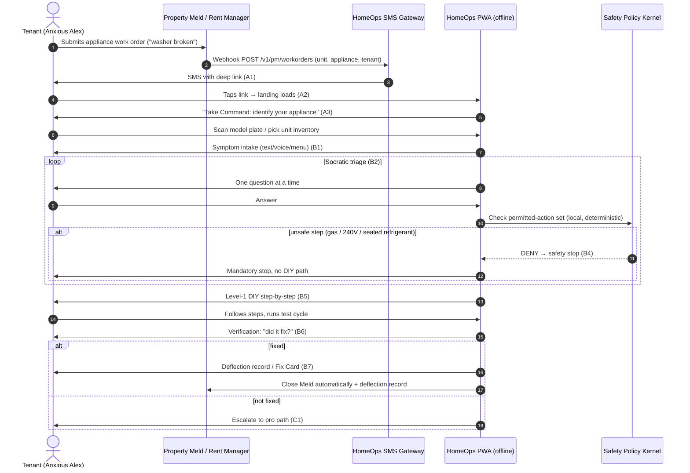
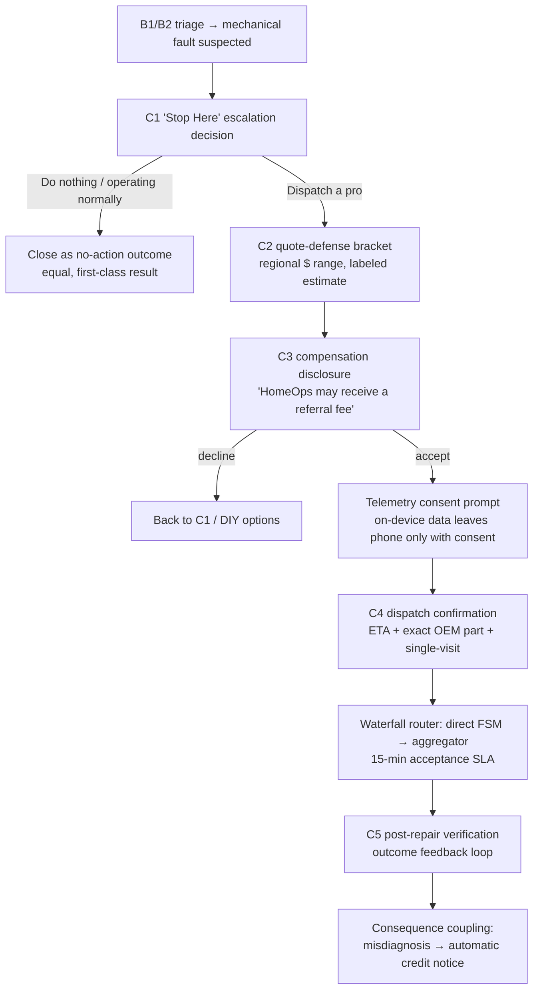
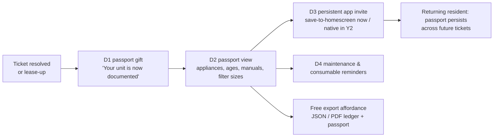
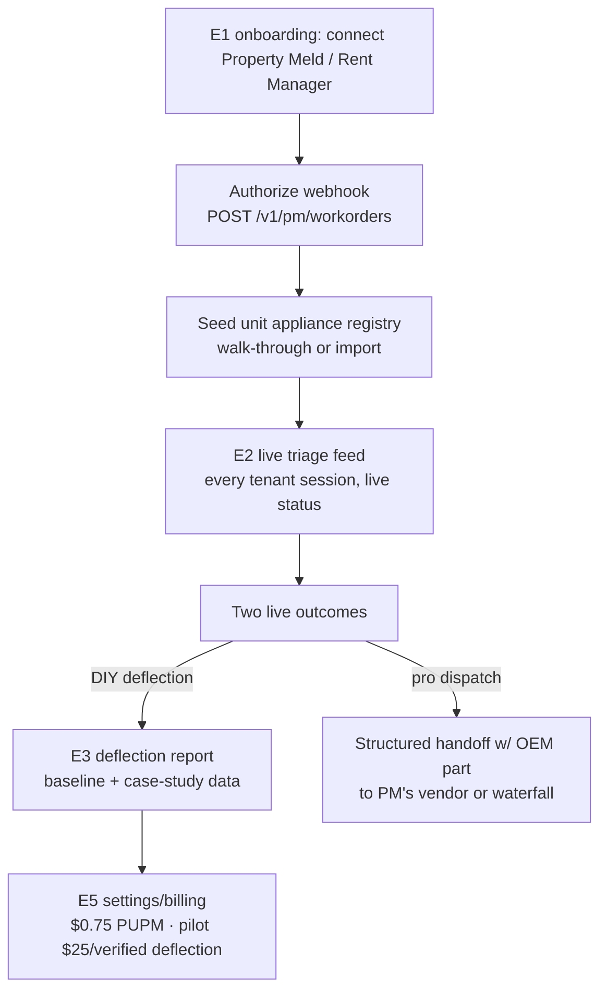

# HomeOps Year 1 PWA + PM Experience — Full UX Walkthrough

**Version:** 1.0
**Date:** 2026-08-19
**Author:** Sally (BMAD UX Director)
**Status:** Working Draft

---

## 0. Scope & Pivot Note (read first)

This walkthrough describes the **Year 1 B2B2C wedge** surface: an **SMS-triggered, zero-install
Progressive Web App (PWA)** for tenants/residents, plus a **desktop web dashboard** for property
managers (PMs). It is binding to **GTM Strategy Rev 3 (2026-08-19)**.

**Do NOT design to the archived direction.** The old React Native/Expo native app, the broker-first
PRD v1.0, and any pre-alignment persona phrasing (including the legacy "SB 542" reference — it is
**SB 244**) are ARCHIVED. This is a **mobile-first PWA (phone ~375×812 portrait)** with a separate
desktop dashboard. Native iOS/Android is **Year 2** (reference only).

**Claim discipline is binding on ALL copy in this document and in the HTML mockups.** The following
terms are BANNED from every user-facing string: *zero-knowledge, immutable, error-free, fraud-proof,
fraud prevention, zero latency, proof of failure time, SB 542*. Say instead: *tamper-evident event
receipt, schema-validated handoff, calibrated confidence*. Every monetary figure shown to a user is
labeled **estimate** or **target** unless it is a measured/sourced fact.

---

## 1. UX Principles

HomeOps operates in a **crisis moment**: an appliance has failed mid-cycle, and the human in front
of the phone is at a low point of agency. The interface must do three things in order: **stop the
harm, restore the sense of control, move to the single next safe action.** Everything else is noise.

### 1.1 Calm Authority
- One primary action per screen. No parallel choices that compete for the same finger.
- Headers are declarative, not interrogative. "Take Command:" opens the action; the screen body
  states what we know and what happens next.
- Density is low. White space is a feature of a system that is not panicking.
- The system never asks a question it can answer from context (model, unit, error code already
  known from intake are pre-filled — never re-asked).

### 1.2 Zero-Install (no download)
- The PWA loads from an SMS deep link; there is **no app store, no account creation, no download
  gate** before the first diagnostic action. Identity is session-scoped to the PM work order.
- "Save to home screen" is offered **only after value has been delivered** (post-resolution or at
  lease-up), never as an entrance fee.
- The shell target is **<1.2 MB** with first paint **<800 ms** (label: *reproducible measurement —
  separate shell from model/OCR/speech/pack assets; report device/OS matrix*).

### 1.3 Offline-First
- Everything after the initial SMS link resolves runs against **WASM SQLite in-browser**. Triage,
  error-code lookup, and Level-1 DIY guidance must work in a basement with no signal.
- Network-dependent steps (dispatch, telemetry) are explicitly badged "needs connection" and queue
  gracefully rather than erroring.
- Confidence scores and safety gates are computed locally by the **deterministic policy kernel** —
  never blocked on a network round-trip.

### 1.4 Trust-by-Design
- The UI is the visible surface of the **10-Point Trust Constitution** (§6). Trust is not a footer;
  it is a **pattern** that repeats: disclosed compensation, visible calibrated confidence, a
  first-class "do nothing" option, free export, deterministic safety stops, consequence coupling.
- Every handoff, every estimate, every score is presented with its **evidence ceiling** — we say what
  is *observed* vs. what is *inferred*, and we never overstate a candidate cause as a confirmed
  diagnosis.

### 1.5 Crisis-State Empathy (the four postures)
The resident persona ("Anxious Alex") arrives in one of four emotional postures. Each posture gets a
distinct design response; the design system supports all four without branching into separate themes.

| Posture | Signal | Design response |
|---|---|---|
| **Panic** | Standing water, flashing code, fear of flood/fire | Safety-gate first (B4), short imperative copy, single oversized CTA, no wall of text. Kill every unnecessary step before the *safe* action. |
| **Confusion** | Erratic behavior, vague symptoms | Socratic one-question-at-a-time triage (B2), plain-language explainer for every code (B3), "why am I seeing this" affordance. |
| **Suspicion** | "Am I being ripped off / blamed?" | Quote-defense bracket (C2), disclosed compensation (C3), tamper-evident receipts (B7), do-nothing as an equal option (C1). Never a dark pattern. |
| **Prevention** | Move-in / lease-up, organizing before failure | Passport (D2), consumable reminders (D4), manual/age inventory. Warm, "welcome home" tone. |

---

## 2. User Journey Flows (Mermaid)

### 2.1 (a) SMS intake → triage → DIY deflection



### 2.2 (b) SMS intake → triage → pro dispatch (with compensation disclosure)



### 2.3 (c) Move-In Bridge / Appliance Passport



### 2.4 (d) PM onboarding + reporting



### 2.5 (e) Edge cases

```mermaid
flowchart TD
    subgraph Safety Stop
    S1[Gas / 240V / sealed refrigerant detected] --> S2[B4 deterministic stop<br/>kernel-enforced, not a warning]
    S2 --> S3[Only safe next action:<br/>shut-off guidance + pro dispatch]
    end
    subgraph Do-Nothing
    N1[Machine operating normally / user declines] --> N2[C1 do-nothing = equal outcome]
    N2 --> N3[Close with no-action receipt<br/>no referral, no upsell]
    end
    subgraph Offline
    O1[No signal during triage] --> O2[Local triage continues;<br/>dispatch/telemetry queued]
    end
    subgraph Misdiagnosis
    M1[Post-repair: part didn't fix it] --> M2[C5 outcome feedback]
    M2 --> M3[Consequence coupling: automatic credit notice<br/>without admitting liability]
    end
```



---

## 3. Complete Screen Inventory (Shared Spine A1–E5)

Every screen: **purpose → key elements → primary CTA → empty/error/loading states.** Wireframes are
concise ASCII; A–D use mobile width (~38 chars), E uses desktop width. The corner-bracket motif
`┌ ┐ └ ┘` marks high-attention zones (safety, compensation, confidence, estimates).

### 3.A — SMS Intake & Entry

#### A1 · SMS trigger (PM work order → link)

```
┌──────────────────────────────────────┐
│  HomeOps  (SMS)              now     │
│                                      │
│  Maintenance request for Unit 4B     │
│  "Dishwasher not draining"           │
│                                      │
│  Your property manager uses HomeOps  │
│  to triage appliance issues.         │
│                                      │
│  → Tap to start a guided check:      │
│  https://ho.link/w4b-a7f2            │
│                                      │
│  No app to install. Works offline.   │
└──────────────────────────────────────┘
```
- **Purpose:** Convert a PM work order into a zero-install diagnostic entry. The first human touch
  after a tenant files a ticket.
- **Key elements:** Unit/request context, deep link, "no app to install" reassurance, sender shows
  as HomeOps-on-behalf-of-PM.
- **Primary CTA:** The deep link itself.
- **Empty/error/loading:** *Error:* link expired (180-day / resolved ticket) → fallback SMS "This
  request is already closed — contact your property manager." *Loading:* none (SMS is static).

#### A2 · PWA landing (calm authority, one-tap)

```
┌──────────────────────────────────────┐
│  ⌂ HOMEOPS                          │
│  Diagnostic Assistant               │
│                                      │
│  Your property manager started a     │
│  check for the dishwasher in Unit 4B.│
│                                      │
│  We'll walk you through it, one      │
│  safe step at a time.               │
│                                      │
│  ┌────────────────────────────────┐  │
│  │  Your data stays on this phone │  │
│  │  unless you approve sharing.   │  │
│  └────────────────────────────────┘  │
│                                      │
│  [  Take Command: Start the check  ] │
│                                      │
│  No account · No download · ~1 min   │
└──────────────────────────────────────┘
```
- **Purpose:** Establish calm authority and one-tap momentum. No friction before the first action.
- **Key elements:** Brand lockup, unit context, on-device data reassurance (Trust #5), single CTA.
- **Primary CTA:** "Take Command: Start the check."
- **Empty/error/loading:** *Loading:* skeleton brand block + CTA shimmer ≤800 ms target. *Error:*
  link invalid/expired → "This request has expired or was already completed." with a PM contact
  fallback. *Empty:* no unit context (direct share) → generic "start a check" entry.

#### A3 · Appliance identification (scan / manual / inventory)

```
┌──────────────────────────────────────┐
│  Identify the appliance              │
│                                      │
│  ┌────────────────────────────────┐  │
│  │       [ camera viewport ]      │  │
│  │   point at the rating plate    │  │
│  └────────────────────────────────┘  │
│                                      │
│  [ Scan model plate ]                │
│  [ Type model number   ]             │
│  [ Pick from Unit 4B    ]  ← pre-seeded │
│                                      │
│  Pre-selected: Whirlpool             │
│  WDT730PAHZ0 · Dishwasher · Unit 4B  │
└──────────────────────────────────────┘
```
- **Purpose:** Lock the exact model so the correct DKM pack and safety boundaries apply.
- **Key elements:** Camera scan via `<input capture="environment">` (capability-detected), manual
  entry fallback, **pre-seeded unit inventory** (from PM registry) as the fastest path.
- **Primary CTA:** "Scan model plate" (or tap the pre-selected unit to skip).
- **Empty/error/loading:** *Empty:* no inventory → hide the pick list, show scan+manual only.
  *Loading:* OCR spinner "Reading plate…". *Error:* OCR unreadable → manual entry with model-suggestion
  autocomplete. *Offline:* OCR/scan requires camera but works on-device; model lookup against local
  catalog proceeds without network.

### 3.B — Triage & Diagnostic

#### B1 · Symptom intake (text / voice / menu)

```
┌──────────────────────────────────────┐
│  What's happening?                   │
│                                      │
│  [ 🎤 Speak ]   [ ⌨️ Type ]          │
│                                      │
│  ┌────────────────────────────────┐  │
│  │ "It stopped draining, water    │  │
│  │  sitting in the bottom."       │  │
│  └────────────────────────────────┘  │
│                                      │
│  Quick picks:                        │
│  · Won't drain / water left          │
│  · Won't start · Leaking · Noisy     │
│  · Error code showing                │
│                                      │
│  Voice works on-device when supported │
└──────────────────────────────────────┘
```
- **Purpose:** Capture the raw symptom in the resident's own words (E0 evidence — conversation
  routing, not telemetry).
- **Key elements:** Voice (webkitSpeechRecognition, capability-detected) and text parity, quick-pick
  menu for panic postures (fewer keystrokes).
- **Primary CTA:** "Continue."
- **Empty/error/loading:** *Loading:* voice mic permission prompt; if denied, text stays default.
  *Error:* speech unsupported → voice button hidden (never shown dead). *Empty:* blank input disabled
  until ≥1 word.

#### B2 · Conversational triage (Socratic, safety-gated)

```
┌──────────────────────────────────────┐
│  HomeOps Assistant                   │
│                                      │
│  ┌────────────────────────────────┐  │
│  │ Q: Is water contained inside   │  │
│  │    the drum, or on the floor?  │  │
│  │  Confidence: gathering…        │  │
│  └────────────────────────────────┘  │
│                                      │
│  [ Drum only ]   [ On the floor ]    │
│                                      │
│  Safety gate: none triggered         │
│  · one question at a time            │
│  · every answer checked locally      │
└──────────────────────────────────────┘
```
- **Purpose:** Narrow toward a candidate cause with one Socratic question per turn; each answer is
  checked against the deterministic policy kernel before any step is offered.
- **Key elements:** Single-question card, visible **confidence display** (Trust #7), local safety-gate
  status, back affordance.
- **Primary CTA:** the top answer option (single tap).
- **Empty/error/loading:** *Loading:* typing indicator between turns. *Error:* answer that triggers a
  safety boundary → routes to B4 immediately. *Empty:* no further questions → transitions to B3/B5.

#### B3 · Error-code lookup + plain-language explainer

```
┌──────────────────────────────────────┐
│  Error code E2 F4                    │
│                                      │
│  In plain language:                  │
│  "Your dishwasher detected it can't  │
│   drain water away."                 │
│                                      │
│  ┌────────────────────────────────┐  │
│  │ Observed: code E2 F4 on panel  │  │
│  │ Inferred: drain-pump jam       │  │
│  │ Confidence: 88% (inferred)     │  │
│  └────────────────────────────────┘  │
│                                      │
│  [ See safe steps ]                  │
│  [ What this code does NOT mean ]    │
└──────────────────────────────────────┘
```
- **Purpose:** Translate a cryptic code into plain language and show the **evidence ceiling** —
  observed vs. inferred, with calibrated confidence.
- **Key elements:** Plain-language gloss, observed-vs-inferred split, confidence percentage, "what
  it doesn't mean" anti-anxiety link.
- **Primary CTA:** "See safe steps."
- **Empty/error/loading:** *Empty:* code not in local pack → manual description + "we'll learn this
  model" (no invented answer). *Loading:* local FTS lookup (µs-scale, no visible spinner needed).
  *Error:* ambiguous code → "this code can mean several things — let's ask one more question."

#### B4 · Safety stop screen (deterministic)

```
┌──────────────────────────────────────┐
│  ⚠ STOP — safety boundary            │
│                                      │
│  ┌────────────────────────────────┐  │
│  │ This step involves a sealed    │  │
│  │ refrigerant system.            │  │
│  │ HomeOps will NOT guide you     │  │
│  │ through this yourself.         │  │
│  └────────────────────────────────┘  │
│                                      │
│  You can safely:                     │
│  · turn the unit off at the panel    │
│  · move items away from the area     │
│                                      │
│  [ Dispatch a licensed pro ]         │
│  [ I'll leave it for now       ]     │
└──────────────────────────────────────┘
```
- **Purpose:** Enforce a **mandatory, deterministic stop** (Trust #8) for gas/240V/sealed refrigerant.
  This is kernel-enforced — not a soft warning — so there is no "proceed anyway."
- **Key elements:** Stop glyph + corner bracket, explicit "will NOT guide you," two safe non-DIY
  actions only.
- **Primary CTA:** "Dispatch a licensed pro" (→ C1/C2).
- **Empty/error/loading:** *Error:* none (no override exists by design). *Loading:* instant local
  kernel decision.

#### B5 · DIY deflection step-by-step (Level 1)

```
┌──────────────────────────────────────┐
│  Step 2 of 4 · Clear the filter      │
│                                      │
│  ┌────────────────────────────────┐  │
│  │  [ illustration / short clip ] │  │
│  └────────────────────────────────┘  │
│                                      │
│  1. Place a shallow tray below the   │
│     lower-front access door.         │
│  2. Twist the filter cap counter-    │
│     clockwise.                       │
│  3. Remove debris, reinstall.        │
│                                      │
│  [ Done — next step ]                │
│  [ I need help ]                     │
│                                      │
│  Level 1 · no tools · no disassembly │
└──────────────────────────────────────┘
```
- **Purpose:** Guide a Level-1 filter/reset fix with confidence, one step per screen, no disassembly.
- **Key elements:** Step progress, single illustration, numbered sub-steps, "I need help" escape hatch.
- **Primary CTA:** "Done — next step."
- **Empty/error/loading:** *Loading:* media (clip/image) lazy-loads from pack; text steps render
  instantly. *Error:* user taps "I need help" → gracefully route to C1 (never a dead end). *Empty:*
  no pack for this model → skip straight to C1 with a clear explanation.

#### B6 · Verification (did it fix?)

```
┌──────────────────────────────────────┐
│  Did that fix it?                    │
│                                      │
│  Run a short test cycle if the unit  │
│  allows it.                          │
│                                      │
│  [ Yes — it's fixed ]                │
│  [ No — still failing ]              │
│  [ Not sure ]                        │
│                                      │
│  Your answer updates the record and  │
│  keeps the diagnosis honest.         │
└──────────────────────────────────────┘
```
- **Purpose:** Close the outcome feedback loop (Trust #9) — a required confirmation before the record
  is finalized.
- **Key elements:** Three-way honest answer, hint to run a test cycle.
- **Primary CTA:** "Yes — it's fixed."
- **Empty/error/loading:** *Loading:* none. *Error:* "Not sure" → one clarifying question, then either
  B5-verify-again or C1.

#### B7 · Deflection record / Fix Card (tamper-evident receipt)

```
┌──────────────────────────────────────┐
│  ✓ Fixed — HomeOps Fix Card          │
│                                      │
│  ┌────────────────────────────────┐  │
│  │ Whirlpool WDT730PAHZ0 · 4B     │  │
│  │ Cleared drain-pump filter      │  │
│  │ Code E2 F4 cleared             │  │
│  │ Receipt: hash-chained event    │  │
│  │ recorded on-device             │  │
│  └────────────────────────────────┘  │
│                                      │
│  Estimated dispatch saved: $150*     │
│  *estimate, not a guarantee          │
│                                      │
│  [ Export record (JSON/PDF) ]        │
│  [ Continue ]                        │
└──────────────────────────────────────┘
```
- **Purpose:** Deliver a **tamper-evident, hash-chained event receipt** (never "immutable," never
  "proof of failure time") plus a clearly-labeled savings estimate.
- **Key elements:** Receipt card, event-receipt language, `$150*` labeled *estimate*, free export
  affordance (Trust #6).
- **Primary CTA:** "Continue" (export is secondary but always visible).
- **Empty/error/loading:** *Loading:* receipt hash write spinner. *Error:* receipt write failure →
  retry; the fix is still recorded but "receipt pending" is shown honestly.

### 3.C — Pro Dispatch Path

#### C1 · "Stop Here" escalation decision (do-nothing = equal option)

```
┌──────────────────────────────────────┐
│  Stop here — your call               │
│                                      │
│  The filter isn't the cause. This    │
│  looks like a mechanical fault.      │
│                                      │
│  Choose what happens next:           │
│                                      │
│  [ Dispatch a pro ]                  │
│  [ Do nothing / it's running         │
│    normally for now ]                │
│  [ Keep trying DIY ]                 │
│                                      │
│  "Do nothing" is a valid outcome.    │
│  No referral is pushed on you.       │
└──────────────────────────────────────┘
```
- **Purpose:** Give the resident a genuine decision point where **"do nothing / operating normally"
  is a first-class, equal outcome** (Trust #2). The engine never funnels to a bounty.
- **Key elements:** Three equal-weight options, explicit "do nothing is valid" copy, no visual
  hierarchy favoring dispatch.
- **Primary CTA:** None dominant — all three options equal (deliberate).
- **Empty/error/loading:** *Error:* none. *Empty:* n/a.

#### C2 · Quote-defense bracket (regional range)

```
┌──────────────────────────────────────┐
│  What this should cost               │
│                                      │
│  ┌────────────────────────────────┐  │
│  │ Drain-pump replacement         │  │
│  │ Regional range: $160 – $240    │  │
│  │ parts + labor (estimate)       │  │
│  │ Based on: region, parts,       │  │
│  │ typical labor time             │  │
│  └────────────────────────────────┘  │
│                                      │
│  This is a dated range, not a quote. │
│                                      │
│  [ Continue to dispatch ]            │
└──────────────────────────────────────┘
```
- **Purpose:** Arm the resident with a transparent regional **estimate range** so they enter any
  negotiation with leverage (Suspicion posture).
- **Key elements:** Corner-bracketed range card, "dated range not a quote" disclaimer, source/region
  note.
- **Primary CTA:** "Continue to dispatch."
- **Empty/error/loading:** *Empty:* insufficient regional comparables → show "no reliable range yet;
  here's what we know" rather than inventing a number. *Loading:* range computation spinner.

#### C3 · Compensation disclosure (bounty disclosed)

```
┌──────────────────────────────────────┐
│  How dispatch works                  │
│                                      │
│  ┌────────────────────────────────┐  │
│  │ DISCLOSURE                    │  │
│  │ HomeOps may receive a referral│  │
│  │ fee from the service partner  │  │
│  │ when you book through us.     │  │
│  │ This does not change your     │  │
│  │ price or who ranks first.     │  │
│  └────────────────────────────────┘  │
│                                      │
│  Ranking is by proximity,            │
│  certification, and fix quality —    │
│  never by who pays us.               │
│                                      │
│  [ I understand — continue ]         │
│  [ Go back ]                         │
└──────────────────────────────────────┘
```
- **Purpose:** Disclose **partner referral compensation** (Trust #3) and **equal ranking** (Trust #4)
  before any dispatch is routed. This is a Trust Constitution requirement, not a legal footnote.
- **Key elements:** Corner-bracketed disclosure card, plain-language ranking explanation, explicit
  consent CTA.
- **Primary CTA:** "I understand — continue."
- **Empty/error/loading:** none.

#### C4 · Dispatch confirmation (ETA, exact part, single-visit)

```
┌──────────────────────────────────────┐
│  Pro on the way                      │
│                                      │
│  ┌────────────────────────────────┐  │
│  │ Technician: (matched)          │  │
│  │ Part: DC31-00178A pump        │  │
│  │ assembly (staged)             │  │
│  │ ETA: today 2–5 PM window      │  │
│  │ Goal: single visit            │  │
│  └────────────────────────────────┘  │
│                                      │
│  Your diagnostic summary is shared   │
│  with the tech so they arrive ready. │
│                                      │
│  [ Confirm dispatch ]                │
│                                      │
│  Sharing telemetry? toggle [off]     │
└──────────────────────────────────────┘
```
- **Purpose:** Confirm a **pre-diagnosed, single-visit** dispatch with exact OEM part staged.
- **Key elements:** Confirmation card (ETA, part, single-visit goal), explicit telemetry consent
  toggle (default off — Trust #5), structured handoff summary.
- **Primary CTA:** "Confirm dispatch."
- **Empty/error/loading:** *Loading:* waterfall router spin (direct FSM → 15-min SLA → aggregator).
  *Error:* no partner in region → "no provider available right now; we'll hold your summary and retry,"
  never a silent drop.

#### C5 · Post-repair verification (outcome feedback loop)

```
┌──────────────────────────────────────┐
│  How did the repair go?              │
│                                      │
│  [ Fixed on first visit ]            │
│  [ Fixed after parts arrived ]       │
│  [ Still not fixed ]                 │
│                                      │
│  ┌────────────────────────────────┐  │
│  │ If our diagnosis missed and    │  │
│  │ you bought a part you didn't   │  │
│  │ need, you may get an automatic │  │
│  │ credit.                        │  │
│  └────────────────────────────────┘  │
│                                      │
│  [ Submit ]                          │
└──────────────────────────────────────┘
```
- **Purpose:** Required post-repair verification (Trust #9) feeding FTFR/deflection metrics, plus the
  **consequence-coupling** notice (Trust #10) — a credit issued *without* admitting liability.
- **Key elements:** Three-outcome feedback, corner-bracketed credit notice, honest framing.
- **Primary CTA:** "Submit."
- **Empty/error/loading:** *Loading:* submit spinner. *Error:* none.

### 3.D — Move-In Bridge & Passport

#### D1 · Passport gift (post-resolution / lease-up)

```
┌──────────────────────────────────────┐
│  Your Appliance Passport             │
│                                      │
│  ⌂ HomeOps has documented Unit 4B.   │
│                                      │
│  Keep every appliance, manual,        │
│  filter size, and warranty in one     │
│  place — free.                       │
│                                      │
│  [ View my passport ]                │
│  [ Save to home screen  ]            │
│                                      │
│  No account required. Yours to keep. │
└──────────────────────────────────────┘
```
- **Purpose:** Convert a resolved ticket or lease-up into a durable relationship: the permanent
  Appliance Passport (GTM §2.4, the "Intel Inside" seeding moment).
- **Key elements:** Gift framing, passport preview, save-to-homescreen.
- **Primary CTA:** "View my passport."
- **Empty/error/loading:** *Empty:* no appliances documented → walk-through scan prompt.

#### D2 · Passport view (appliances, ages, manuals)

```
┌──────────────────────────────────────┐
│  Unit 4B · Appliance Passport        │
│                                      │
│  ┌────────────────────────────────┐  │
│  │ Dishwasher · Whirlpool         │  │
│  │ WDT730PAHZ0 · age ~6 yrs       │  │
│  │ [ Manual ] [ Filter size ]     │  │
│  └────────────────────────────────┘  │
│  ┌────────────────────────────────┐  │
│  │ Refrigerator · GE GFE28GYNFS  │  │
│  │ age ~8 yrs · [ Manual ]        │  │
│  └────────────────────────────────┘  │
│                                      │
│  [ + Add appliance ]                 │
│  [ Export passport (JSON/PDF) ]      │
└──────────────────────────────────────┘
```
- **Purpose:** The household's persistent appliance memory — models, ages, manuals, consumables.
- **Key elements:** Per-appliance cards (make/model/age/manual/filter), add + free export affordance.
- **Primary CTA:** tap an appliance card (or "Add appliance" when empty).
- **Empty/error/loading:** *Empty:* zero appliances → illustrated "scan your first appliance" CTA.
  *Loading:* passport fetch spinner. *Error:* sync failure → local cached copy shown, "offline copy"
  badge.

#### D3 · Persistent app invite (save-to-homescreen now; native install Y2)

```
┌──────────────────────────────────────┐
│  Keep HomeOps one tap away           │
│                                      │
│  ⌂ Save to your home screen — it     │
│    works offline, no app store.      │
│                                      │
│  [ Save to home screen ]             │
│                                      │
│  (A full native app arrives in a     │
│   later update.)                     │
│                                      │
│  [ Not now ]                         │
└──────────────────────────────────────┘
```
- **Purpose:** Convert the PWA into a persistent install (A2HS) at the moment of demonstrated value;
  native install is explicitly Year 2.
- **Key elements:** A2HS CTA, honest Year-2 native note, "not now" escape.
- **Primary CTA:** "Save to home screen."
- **Empty/error/loading:** *Error:* browser doesn't support A2HS → hide CTA, show bookmark hint.

#### D4 · Maintenance / consumables reminders

```
┌──────────────────────────────────────┐
│  Reminders                           │
│                                      │
│  ┌────────────────────────────────┐  │
│  │ Water filter · due in 2 wks    │  │
│  │ [ Mark done ] [ Snooze ]       │  │
│  └────────────────────────────────┘  │
│  ┌────────────────────────────────┐  │
│  │ Dryer duct lint · due in 1 mo  │  │
│  │ [ Mark done ] [ Snooze ]       │  │
│  └────────────────────────────────┘  │
│                                      │
│  Recall watch: none for your models  │
└──────────────────────────────────────┘
```
- **Purpose:** Preventive posture support (Prevention) — consumable tracking + CPSC recall watch.
- **Key elements:** Consumable cards with due dates, mark-done/snooze, recall status line.
- **Primary CTA:** "Mark done."
- **Empty/error/loading:** *Empty:* "no reminders yet — add a filter change schedule." *Error:* recall
  API unreachable → "recall check offline; will re-check when connected."

### 3.E — PM Experience (web dashboard, desktop-width)

#### E1 · Onboarding / integration (Property Meld webhook)

```
┌────────────────────────────────────────────────────────────────────────┐
│  HomeOps · Property Manager                    [Portfolio] [Settings]  │
├────────────────────────────────────────────────────────────────────────┤
│  Connect your platform                                                 │
│                                                                        │
│  ┌─ Property Meld ──────────────────────────────────────────────────┐  │
│  │  Status: Not connected                                           │  │
│  │  Webhook: POST /v1/pm/workorders                                  │  │
│  │  [ Connect Property Meld ]  [ Use API key ]                       │  │
│  └──────────────────────────────────────────────────────────────────┘  │
│  ┌─ Rent Manager ───────────────────────────────────────────────────┐  │
│  │  Status: Not connected    [ Connect Rent Manager ]               │  │
│  └──────────────────────────────────────────────────────────────────┘  │
│                                                                        │
│  [ Continue → seed appliance registry ]                                │
└────────────────────────────────────────────────────────────────────────┘
```
- **Purpose:** Connect the PM's existing work-order platform so tenant appliance tickets auto-flow
  into HomeOps triage.
- **Key elements:** Integration cards with webhook/API endpoints and connection status.
- **Primary CTA:** "Connect Property Meld."
- **Empty/error/loading:** *Loading:* OAuth handshake spinner. *Error:* auth failure → retry + support
  link. *Empty:* no platform selected → default Property Meld highlighted.

#### E2 · Live triage feed

```
┌────────────────────────────────────────────────────────────────────────┐
│  HomeOps · Live triage feed                                            │
├────────────────────────────────────────────────────────────────────────┤
│  Unit   Appliance   Issue            Status            Outcome         │
│  4B     Dishwasher  "not draining"   Step 3/4 DIY      —               │
│  12A    Washer      "won't spin"     Pro dispatch      Part staged     │
│  7C     Fridge      "not cooling"    Safety stop       Pro dispatched  │
│  3D     Dryer       "no heat"        Resolved DIY      $150 est saved* │
│                                                                        │
│  [ Filter: All ▾ ]  [ Search… ]            [ Export feed ]             │
└────────────────────────────────────────────────────────────────────────┘
```
- **Purpose:** Real-time visibility into every tenant diagnostic session and its current state.
- **Key elements:** Status table, live outcome column, filter/search/export.
- **Primary CTA:** row click → detail drawer.
- **Empty/error/loading:** *Empty:* "no sessions yet — sessions appear here when tenants start a
  check." *Loading:* live-update spinner. *Error:* stream drop → "reconnecting…" banner.

#### E3 · Deflection report (case-study data, baselines)

```
┌────────────────────────────────────────────────────────────────────────┐
│  HomeOps · Deflection report                                           │
├────────────────────────────────────────────────────────────────────────┤
│  Period: last 30 days        [ Export ]                                │
│                                                                        │
│  ┌─ Deflection rate ────────────────────────────────────────────────┐  │
│  │  Baseline: —      Pilot target: ≥25%      Actual: 31% (n=214)    │  │
│  │  ████████████████░░░░░░░░░░░░░░░░░░░░░░░░░░░░░░░░░░░ 31%        │  │
│  └──────────────────────────────────────────────────────────────────┘  │
│  ┌─ First-time fix rate ────────────────────────────────────────────┐  │
│  │  Pilot target: ≥80%         Actual: 84% (n=86 dispatches)        │  │
│  └──────────────────────────────────────────────────────────────────┘  │
│                                                                        │
│  *Targets — pilot measurements with baseline + confidence interval.    │
└────────────────────────────────────────────────────────────────────────┘
```
- **Purpose:** Show deflection and FTFR against **pilot targets (≥25% / ≥80%)**, clearly labeled as
  targets with sample size, ready for case-study publication.
- **Key elements:** Baseline vs. target vs. actual, sample size `n`, CI note, export.
- **Primary CTA:** "Export."
- **Empty/error/loading:** *Empty:* insufficient data → "collecting data — check back after N sessions."
  *Error:* metrics pipeline failure → "metrics unavailable." *Loading:* chart skeleton.

#### E4 · Portfolio appliance registry

```
┌────────────────────────────────────────────────────────────────────────┐
│  HomeOps · Appliance registry                  [ + Import / Scan ]      │
├────────────────────────────────────────────────────────────────────────┤
│  Unit   Appliance    Make/Model           Age    Warranty  Recall       │
│  4B     Dishwasher   Whirlpool WDT730…    ~6 yr  None       None        │
│  4B     Fridge       GE GFE28GYNFS        ~8 yr  None       None        │
│  12A    Washer       Samsung WF45R61…     ~4 yr  Yes        Watch       │
│                                                                        │
│  [ Filter by property ▾ ]  [ Filter by age ▾ ]  [ Export CSV ]          │
└────────────────────────────────────────────────────────────────────────┘
```
- **Purpose:** The unit-level asset ledger: models, serials, ages, warranty, recalls — the source of
  the pre-seeded tenant inventory (A3) and CapEx planning data.
- **Key elements:** Registry table with recall/warranty columns, import/scan, export.
- **Primary CTA:** "Import / Scan" (or row click).
- **Empty/error/loading:** *Empty:* "no appliances yet — run a walk-through scan or import."
  *Loading:* import progress bar. *Error:* import parse failure → per-row error list.

#### E5 · Settings / billing ($0.75 PUPM)

```
┌────────────────────────────────────────────────────────────────────────┐
│  HomeOps · Settings & billing                                          │
├────────────────────────────────────────────────────────────────────────┤
│  Plan                                                                   │
│  ┌─ Pricing ─────────────────────────────────────────────────────────┐  │
│  │  Standard: $0.75 / unit / month (PUPM)   [ target pricing ]       │  │
│  │  Pilot: $25.00 per verified deflected dispatch                    │  │
│  │  Units on plan: 312            Est. monthly: $234.00*             │  │
│  └──────────────────────────────────────────────────────────────────┘  │
│  ┌─ Integrations ────────────────────────────────────────────────────┐  │
│  │  Property Meld: Connected · Webhook healthy                       │  │
│  └──────────────────────────────────────────────────────────────────┘  │
│                                                                        │
│  [ Manage payment ]   [ Disconnect ]                                   │
└────────────────────────────────────────────────────────────────────────┘
```
- **Purpose:** Plan, billing, and integration management. Pricing is labeled **target/hypothesis**
  until contracted.
- **Key elements:** Pricing card with PUPM + pilot terms, unit count, est. monthly, integration health.
- **Primary CTA:** "Manage payment."
- **Empty/error/loading:** *Error:* payment failure → banner + retry. *Loading:* invoice fetch spinner.

---

## 4. Design System Tokens

### 4.1 Color

| Token | Hex | Use |
|---|---|---|
| `--green-deep` | `#005B5D` | Primary CTA, headers, brand, focus ring, corner brackets (subtle) |
| `--green-deep-hover` | `#004749` | Primary CTA hover/pressed |
| `--white` | `#FFFFFF` | Text on green, card backgrounds |
| `--gray-light` | `#F0F0F0` | Secondary backgrounds, dividers, input fills |
| `--gray-mid` | `#8A8F8A` | Secondary text, borders |
| `--ink` | `#1A1F1A` | Primary body text (dark neutral for contrast) |
| `--amber-warn` | `#B45309` | Safety stop / caution (B4) |
| `--red-danger` | `#B91C1C` | Destructive, gas/240V boundaries |
| `--blue-info` | `#1D4ED8` | Informational status, links |

Contrast: `#005B5D` on `#FFFFFF` = ~7.9:1 (AA/AAA for normal text). `#1A1F1A` on `#F0F0F0` ≥ 12:1.

### 4.2 Type scale (Inter, fallback sans-serif)

| Role | Size / Line | Weight | Use |
|---|---|---|---|
| Display | 28 / 34 | 700 | Landing hero (A2) |
| Title | 22 / 28 | 600 | Screen titles |
| Heading | 17 / 24 | 600 | Card headers, section titles |
| Body | 16 / 24 | 400 | Primary reading |
| Label | 13 / 18 | 500 | Inputs, buttons |
| Caption | 12 / 16 | 400 | Disclaimers, estimates, footnotes |

### 4.3 Spacing (8-pt grid)

Base unit **8px**: `4 / 8 / 12 / 16 / 24 / 32 / 48`. Mobile page padding = **16px** horizontal.
Card gap = **16px**. Button height = **48px** (min touch target). Corner-bracket inset = **8px**.

### 4.4 Corner brackets

High-attention zones (safety, compensation, confidence, estimates) are framed by corner brackets —
the four corners of the card, drawn as short `┌ ┐ └ ┘` strokes in a subtle green or neutral gray
(`--gray-mid`), inset 8px. Brackets **frame** the zone without fully enclosing it, per brand guide.

### 4.5 Focus rings

Every interactive element receives a visible focus ring on keyboard focus: **2px solid `#005B5D`**
with a 2px offset on white, inverted to `#FFFFFF` on green. Never removed, only restyled.

### 4.6 Buttons

- **Primary:** 48px height, `#005B5D` fill, `#FFFFFF` text, 8px radius, full-width on mobile.
- **Secondary:** `#FFFFFF` fill, 1px `#005B5D` border, `#005B5D` text.
- **Tertiary / text:** `#1D4ED8` link-style, underline on hover.
- **Disabled:** `#F0F0F0` fill, `#8A8F8A` text, no shadow.

### 4.7 Cards

White fill, 1px `#F0F0F0` border (2px `#005B5D` for attention cards), 8px radius, 16px padding,
8-pt-aligned. Attention cards add corner brackets.

### 4.8 Status indicators

| State | Visual |
|---|---|
| Safe / resolved | Deep-green dot + "Fixed" / "Resolved" |
| In progress | Amber dot + "Step 2/4" |
| Safety stop | Red dot + "Stop — safety boundary" |
| Confidence | Inline pill: `Confidence: 88% (inferred)` — green ≥85%, amber 60–84%, gray <60% |
| Estimate | Prefixed `~` + trailing `*estimate` in caption gray |

---

## 5. Voice & Microcopy

### 5.1 Agentive-voice guidelines

Lead with action verbs. Calm, commanding, reassuring, action-oriented — **never** vague, passive, or
intimidating. Use "Take Command:" to open directives. No jargon without a plain-language gloss.

| Don't | Do |
|---|---|
| "Your refrigerator might need service." | "Take Command: run a 3-minute diagnostic check." |
| "Error occurred." | "Here's what happened and the one safe next step." |
| "Proceed to purchase." | "Book a pro — here's exactly what it should cost first." |

### 5.2 Example copy per screen type

- **Calm / commanding (landing, step guidance):** "Take Command: start the check." / "Step 2 of 4 —
  clear the filter."
- **Reassuring (explainers, verification):** "In plain language: your dishwasher can't drain. This is
  usually a blocked filter — a fix you can do safely in a few minutes."
- **Suspicion-defusing (quote, compensation):** "This is a dated range, not a quote. Ranking is by
  proximity, certification, and fix quality — never by who pays us."
- **Safety (never intimidating, always firm):** "Stop here. This involves a sealed refrigerant system.
  HomeOps won't guide you through this yourself — and that's to keep you safe."
- **Estimates (always labeled):** "Estimated dispatch saved: $150*" + "*estimate, not a guarantee."

### 5.3 Banned-claims-aware phrasing

Never write *zero-knowledge, immutable, error-free, fraud-proof, zero latency, proof of failure time,
SB 542*. Use the sanctioned substitutes:

| Banned | Sanctioned |
|---|---|
| immutable log | tamper-evident, hash-chained event receipt |
| error-free payload | schema-validated handoff |
| proves failure time | an event was reported no later than a verifiable receipt |
| fraud-proof | tamper-evident, replay-resistant within a stated threat model |
| zero latency | measured p50/p95/p99 per device |

---

## 6. Trust Constitution UI Requirements

| # | Principle | UI pattern | Where |
|---|---|---|---|
| 1 | Firewalled diagnostic engine | Diagnostic path never surfaces referral/upsell; monetization lives only in C3/C4 | B1–B7, C1 |
| 2 | No forced action | "Do nothing / operating normally" rendered equal-weight to dispatch | C1 |
| 3 | Disclosed referral compensation | Corner-bracketed disclosure card + explicit "I understand" consent | C3 |
| 4 | Equal ranking | "Ranked by proximity, certification, fix quality — never who pays us" copy | C3, C4 |
| 5 | On-device data sovereignty | "Stays on this phone" reassurance (A2); telemetry consent toggle default **off** | A2, C4 |
| 6 | Free export | "Export (JSON/PDF)" affordance always present | B7, D2, E2–E4 |
| 7 | Transparent confidence | Observed-vs-inferred split + calibrated % on every diagnostic screen | B2, B3 |
| 8 | Conservative safety boundaries | Deterministic stop, no override, "will NOT guide you" | B4 |
| 9 | Outcome feedback loop | Required post-repair verification | B6, C5 |
| 10 | Consequence coupling | Automatic credit notice, "without admitting liability" framing | C5, B7 |

### 6.1 Compensation disclosure pattern (C3)
Always present, always before routing. Corner-bracketed card, plain language, explicit consent. No
buried-in-footer disclosure. **Copy:** "HomeOps may receive a referral fee from the service partner
when you book through us. This does not change your price or who ranks first."

### 6.2 Confidence display pattern (B2/B3)
Split every diagnostic statement into **Observed** (an evidence item we actually saw — a code, a
photo, a measurement) vs **Inferred** (a candidate cause). Show a calibrated percentage, color-coded,
with the word "(inferred)" or "(observed)" — never an unqualified "85% diagnosis."

### 6.3 Do-nothing option (C1)
"Do nothing / it's running normally for now" is a full-size, equal-weight option — not a dimmed
escape link. Selecting it closes the session with a no-action receipt and **no referral, no upsell.**

### 6.4 Deterministic safety stop pattern (B4)
Rendered only when the policy kernel denies a step (gas/240V/sealed refrigerant). No "proceed anyway"
exists. The only paths are "dispatch a licensed pro" or "leave it for now."

### 6.5 Free export affordance
"Export (JSON/PDF)" appears on B7 (Fix Card), D2 (passport), and PM E2–E4. One tap, no account,
open formats. Export is always free (Trust #6).

### 6.6 Consequence-coupling credit notice
On C5 (and referenced on B7), the corner-bracketed notice: "If our diagnosis missed and you bought a
part you didn't need, you may get an automatic credit." Framed as a correction, **not an admission of
liability.**

---

## 7. Accessibility

- **Focus rings:** 2px solid `#005B5D` (white on green) on every focusable element; visible, never
  removed. Keyboard order matches visual order.
- **Contrast:** `#005B5D`/`#FFFFFF` ≈ 7.9:1; body `#1A1F1A` on `#F0F0F0` ≥ 12:1; disclaimers ≥ 4.5:1.
- **Screen-reader labels:** every CTA has a descriptive accessible name ("Take Command: start the
  check," not "button"). Confidence/status conveyed in text, not color alone. Corner brackets are
  decorative (aria-hidden) — meaning lives in the text.
- **Voice alternative:** triage fully operable via `webkitSpeechRecognition` where supported; voice is
  an **option**, never a requirement (text parity everywhere). Mic permission denied → text default,
  no dead voice button shown.
- **Reduced motion:** honor `prefers-reduced-motion` — disable step-transition and status animations,
  keep instant state changes.
- **Touch targets:** ≥48px hit area; buttons full-width on mobile; ≥8px spacing between targets.
- **Error identification:** errors stated in text with a path forward ("link expired — contact your
  property manager"), never icon-only.

---

## 8. HTML Mockups (Deliverable #2)

Five standalone, mobile-first HTML files (no frameworks, inline CSS only, brand style — Deep Green
`#005B5D`, Inter, corner brackets) live in:

`/home/batkinson/homeops/_bmad-output/planning-artifacts/homeops-pwa-html-mockups/`

1. `a2-pwa-landing.html` — A2 PWA landing
2. `b2-triage-chat.html` — B2 conversational triage (with confidence display)
3. `b5-diy-step.html` — B5 DIY deflection step
4. `c3-pro-dispatch-handoff.html` — C3 pro dispatch handoff **with compensation disclosure**
5. `d2-passport-view.html` — D2 passport view

Each renders as a centered phone (375×812) on a neutral backdrop, self-contained, opens directly in
a browser.

---

## Appendix A — Binding constraints quick reference

- **Pilot targets (label as TARGETS):** deflection ≥25%, FTFR ≥80%.
- **Bounties (label as hypothesis):** $55–85 (direct FSM $75–85; aggregator $50–65).
- **Pricing (label as target/hypothesis):** $0.75 PUPM standard; $25/verified deflected dispatch (pilot).
- **Saved-per-deflection (label estimate):** $150.
- **Banned claims:** zero-knowledge, immutable, error-free, fraud-proof, zero latency, proof of
  failure time, SB 542 → use tamper-evident event receipt / schema-validated handoff / calibrated
  confidence.
- **Statute:** California Right to Repair is **SB 244** (not SB 542).
